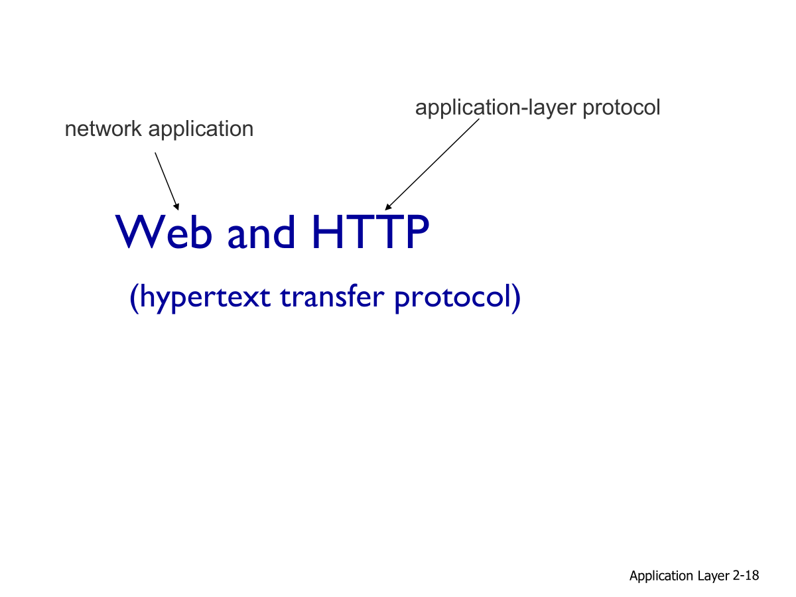
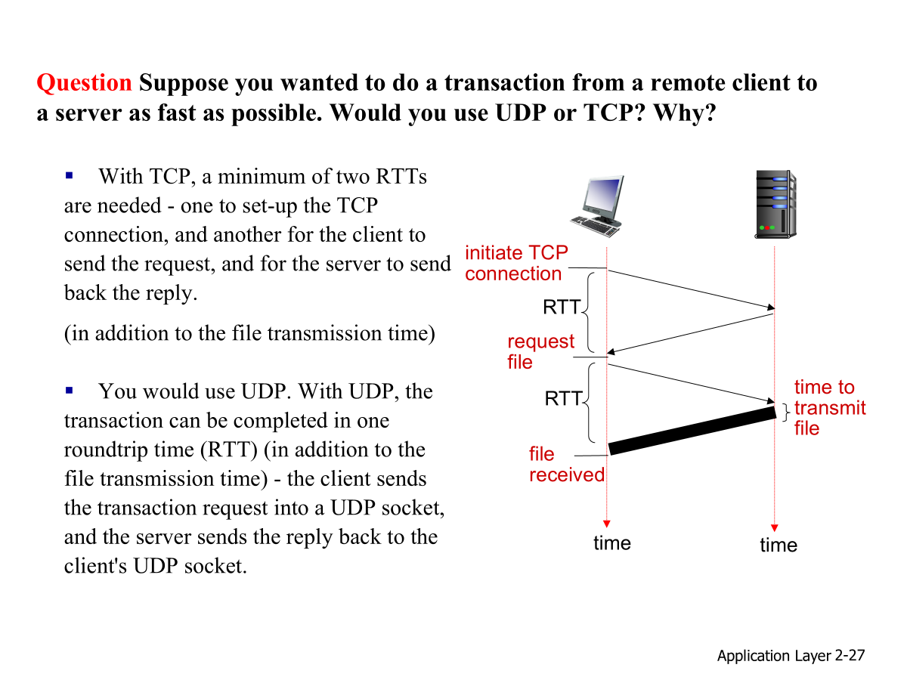
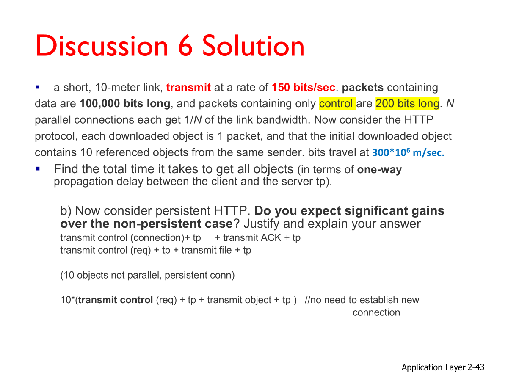
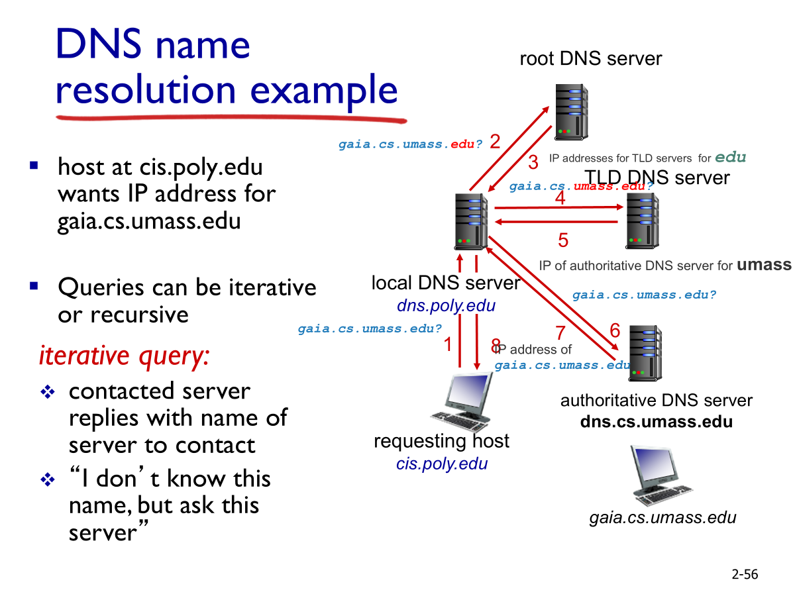
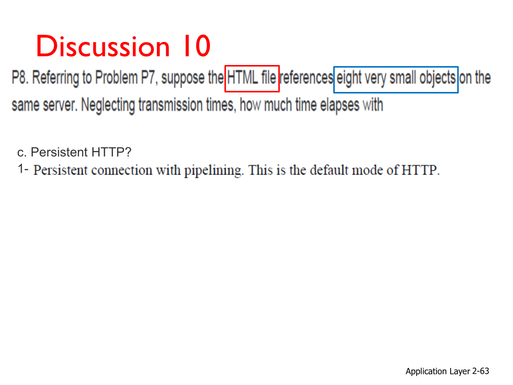
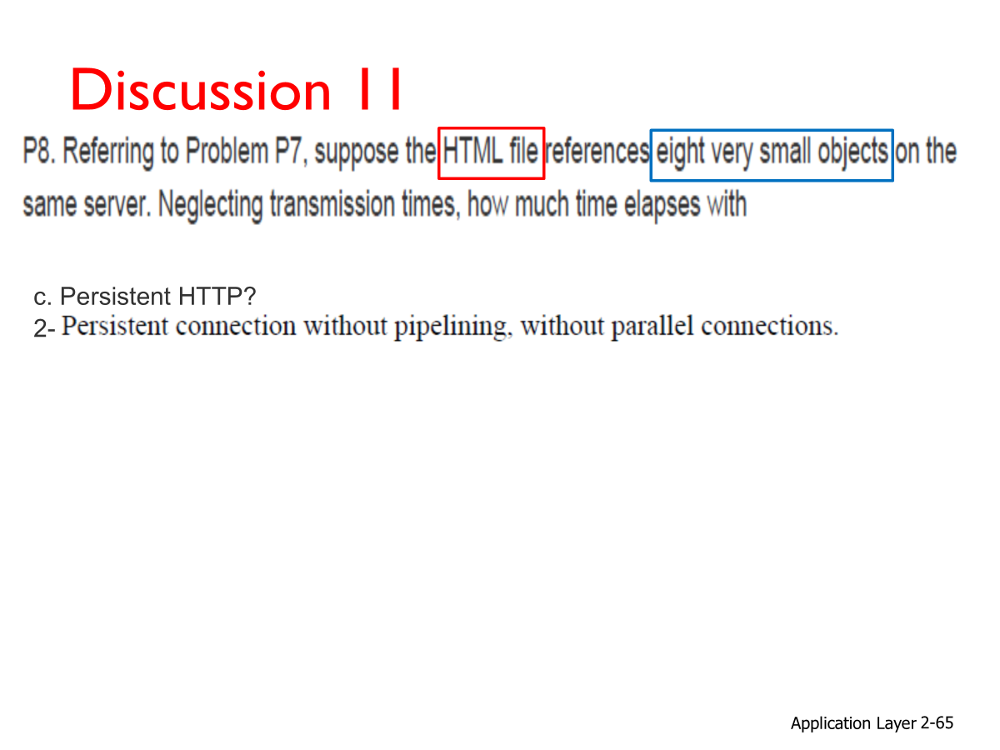

# useful material
https://csdiy.wiki/%E8%AE%A1%E7%AE%97%E6%9C%BA%E7%BD%91%E7%BB%9C/topdown/#_1
https://gaia.cs.umass.edu/kurose_ross/lectures.php
课程作业：https://cs144.github.io/，8 个 Project 带你实现整个 TCP/IP 协议栈
PKUFlyingPig/Computer-Network-A-Top-Down-Approach - GitHub

### P2P architecture
- no always-on server
- arbitrary end systems directly communicate
- peers request service from other peers, provide service in return to other peers
- peers are intermittently connected and change IP addresses
ex: file sharing, video conference

## Sockets插座
 定义：

在网络编程中，socket 是一个软件结构，它允许应用程序通过网络协议进行通信。通常，socket 使用 IP 地址和端口号来标识网络上的唯一端点。

通信类型：

面向连接的（TCP）：这种类型的 socket 提供可靠的数据传输。它确保数据包按顺序到达，并处理数据丢失或错误的问题。
无连接的（UDP）：这种类型的 socket 提供较低的延迟，但不保证数据的到达顺序或完整性。

A **socket** is the interface between the application layer and the transport layer within a host. It is also referred to as the Application Programming Interface (API)

## Addressing processes
- to receive messages, a **process** must have an *identifier*
- **host** device has unique 32-bit IP address
- **Q**: does the IP address of a host on which process runs suffice for identifying the process?
  - **A**: no, *many* processes can be running on same host

- the *identifier* of a process includes both **IP address** of host and a **port number** associated with process on host.
- example port numbers:
  - HTTP server: 80
  - mail server: 25
- to send HTTP message to gaia.cs.umass.edu web server:
  - **IP address**: 128.119.245.12
  - **port number**: 80

## Process Identification in Network Communications

## 网络通信中的进程识别

### IP地址
- **作用**：在网络上识别主机设备。
- **详细说明**：一个唯一的32位数字，分配给连接到互联网协议网络的每个设备。

### 为什么单独的IP地址不够
- **多进程**：一个主机可以同时运行多个进程。IP地址只能识别主机，而不是主机上运行的各个进程。
- **通信需求**：网络通信（如HTTP、FTP等）需要连接到主机上的特定服务或进程。

### 解决方案：端口号
- **端口号的作用**：端口号与IP地址一起使用，用于唯一识别主机上的进程/服务。
- **如何工作**：一个IP地址加上一个端口号形成一个套接字。例如，IP地址`192.168.1.1`与端口`80`表示运行在主机`192.168.1.1`上的Web服务器进程。

### 示例
- **IP地址**：`192.168.1.1`
- **端口**：`80`（通常用于HTTP）
- **套接字**：`192.168.1.1:80`
  - 这个套接字指向在`192.168.1.1`主机上运行的HTTP服务器进程。

### 结论
- 为了在网络主机上唯一识别和通信特定的进程，需要IP地址与端口号的组合。这使得不同设备上的进程之间能够精确地定位和通信。

## Application layer protocol defines

- types of messages exchanged,  
  *e.g.*, request, response  
- **message syntax**:  
  what fields in messages & the exact position of these fields  
- **message semantics**:  
  meaning of information in fields  
- rules for when and how processes send & respond to messages  
- 交换的消息类型，  
  *例如*，请求、响应  
- **消息语法**：  
  消息中的字段及其精确位置  
- **消息语义**：  
  字段中信息的含义  
- 进程发送和响应消息的规则  

## What transport service does an app need?

There are several transport-layer protocols that differ in the types of services they offer to the applications.

- **data integrity**  
  - some apps (*e.g.*, file transfer, web transactions) require **100% reliable data transfer**  
  - other apps (*e.g.*, audio) can tolerate some loss  

- **timing**  
  - some apps (*e.g.*, internet telephony, interactive games) require low delay to be "effective"  

- **throughput**  
  - some apps (*e.g.*, multimedia) require a minimum amount of throughput (r bps > min) to be "effective"  
  - other apps ("elastic apps") make use of whatever throughput they get (*e.g.*, email)  

- **security**  
  - encryption, data integrity, ...  

---

### 应用程序需要什么传输服务？

不同的传输层协议在提供给应用程序的服务类型上有所不同。

- **数据完整性**  
  - 一些应用程序（*例如*，文件传输、网页交易）需要**100%可靠的数据传输**  
  - 其他应用程序（*例如*，音频）可以容忍一些数据丢失  

- **时延**  
  - 一些应用程序（*例如*，网络电话、互动游戏）要求低延迟才能“有效”  

- **吞吐量**  
  - 一些应用程序（*例如*，多媒体）需要最低限度的吞吐量（r bps > 最小值）才能“有效”  
  - 其他应用程序（“弹性应用程序”）会利用它们所获得的任何吞吐量（*例如*，电子邮件）  

- **安全性**  
  - 加密、数据完整性，...  

  

  TCP service: Transmission Control Protocol 
  UDP service: User Datagram Protocol 
  

  

  

  
  

  
  !
  

  ## DNS：domain name system

