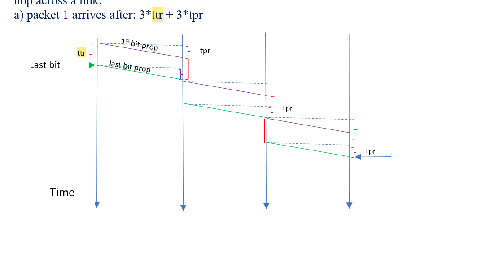
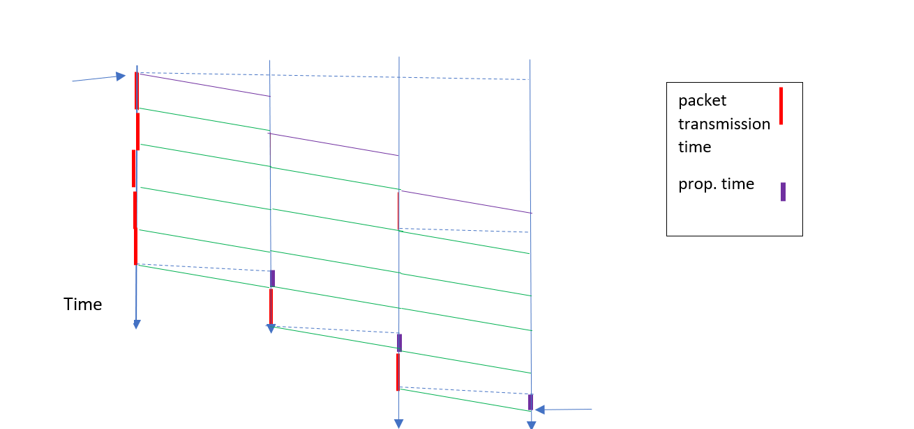

$t_{tr}$ 是指传输时间（transmission time），它表示将一个包的所有比特发送到链路上所需的时间。计算公式为：

$$
t_{tr} = \frac{\text{包的大小（bits）}}{\text{链路的比特率（bits per second）}}
$$

在这个例子中，包的大小为 5000 比特，比特率为 100 kbps，所以传输时间 $t_{tr}$ 为：

$$
t_{tr} = \frac{5000 \text{ bits}}{100 \text{ kbps}} = 50 \text{ msec}
$$

$t_{pr}$ 是指传播延迟（propagation delay），它表示信号从链路的一端传播到另一端所需的时间。这与链路的物理长度和信号在介质中的传播速度有关，而与数据大小无关。计算公式为：

$$
t_{pr} = \frac{\text{链路的长度}}{\text{信号传播速度}}
$$

在这个例子中，给出的传播延迟 $t_{pr}$ 是 4 毫秒（msec），这适用于每条链路的传播时间。


## Important Note
### What is 1 Mega and 1 Giga?

When referring to Memory sizes or Data sizes as powers of 2, we usually add an "i" to KB, MB, GB and use **KiB, MiB, and GiB**.

- **1 KiB = 2^10 = 1024 Bytes** (kibibyte)
- **1 MiB = 1024 KiB = 2^20 Bytes**. The mebi prefix in MebiByte (MiB) stands for mega and binary – which refers to it as being a power of 2.
- **1 GiB (gibibyte) = 2^30 Bytes**

When the "i" is not used, powers of 10 are used to define KB, MB, and GB.

- **1 KB = 10^3 Bytes = 1000 Bytes**
- **1 MB = 10^6 Bytes = 1,000,000 Bytes**
- **1 GB = 10^9 Bytes = 1,000,000,000 Bytes**

**Capital B** refers to **Bytes**, whereas **lowercase b** refers to **bits**.


### Question 3:
In packet switching with store-and-forward, a packet needs to be received in full at a switching node or router before it can be placed on an outgoing link and transmitted. Consider a linear path consisting of a source host, a destination host and 2 intermediate routers (there are 3 intermediate links). The source has 5 packets of size 5000 bits each. All links have a propagation delay of 4 msec and a bit rate of 100 kbps. Neglect processing and queuing delays at the intermediate switches/routers.

**a) How long it takes to receive packet 1 at the destination host?**  
**b) How long it takes to receive all 5 packets at the destination host?**  
**c) Draw a time-space graph of this problem.**

---


### Solution:

It takes $t_{tr} = \frac{5000 \text{ bits}}{100 \text{ kbps}} = 50 \text{ msec}$ to transmit packet 1, then $t_{pr} = 4 \text{ msec}$ to propagate it to Router1. By the time the last bit of packet 1 arrives at Router1, the preceding bits are already accepted by the router (the time it takes router $j$ to receive the bits is overlapped with time $t_{pr}$ on the previous link and $t_{tr}$ of router $j-1$). So it takes the packet $t_{tr} + t_{pr}$ for each hop across a link.

**a)** Packet 1 arrives after:  
$$
3 \cdot t_{tr} + 3 \cdot t_{pr}
$$

---

**b)** The $N$ packets are transmitted back to back. Immediately after the source transmits packet 1, it starts transmitting packet 2. Therefore, by the time packet 1 is received by the destination, all $N-1 = 4$ remaining packets follow and arrive at the destination at time:  
N个数据包被背对背传输。在源发送数据包1后，它立即开始发送数据包2，因此，当目的地接收到数据包1时，所有N-1=剩余的4个数据包都会在时间7*ttr+3*tpr到达目的地
在解决方案的 **b)** 部分中，"7" 和 "3" 的来源与传输时间和传播延迟的累积计算有关。

---

- **传输时间 $t_{tr}$** 表示每个包在每个链路上的传输时间。
- 在这道题目中，源主机有 5 个包要传输。因为包是连续传输的，第一个包到达目的地时，其后的 4 个包已经部分或完全传输。因此，当第一个包到达目的地时，剩余的 4 个包也会陆续到达。因此，需要考虑所有 5 个包的传输时间。
  
  计算 5 个包传输完的总时间为：
  - 第一个包传输到目的地的时间：$3 \cdot t_{tr}$ （3 条链路，每条链路上需要一个 $t_{tr}$）。
  - 剩余 4 个包的传输时间：$4 \cdot t_{tr}$ （因为这些包是在第一个包传输时开始陆续传输的）。
  
  所以总共是 $3 \cdot t_{tr} + 4 \cdot t_{tr} = 7 \cdot t_{tr}$。

---


- **传播延迟 $t_{pr}$** 是指信号在每条链路上的传播时间。每个包在到达目的地之前要经过 3 段链路（从源到第一个路由器，从第一个路由器到第二个路由器，从第二个路由器到目的地）。
  
  由于有 3 条链路，所以总的传播延迟是：
  $$ 
  3 \cdot t_{pr}
  $$

---
```
所以就是计算第一个包的ttr 和tpr 
加上剩下包的 ttr就是总共五个包的时间
```
因此，总时间为 $7 \cdot t_{tr} + 3 \cdot t_{pr}$。

$$
7 \cdot t_{tr} + 3 \cdot t_{pr}
$$

---

In packet switching with store-and-forward, a packet needs to be received in full at a switching node or router before it can be placed on an outgoing link and transmitted. In cut-through switching, as soon as the first hundred or so bits of the packet (referred to as header) are received, the outgoing link can be determined, and if it is free, transmission can start immediately on that link. Suppose there are 125 header bits in each packet. 
在具有存储转发的分组交换中，分组需要在交换节点或路由器处被完全接收，然后才能被放置在输出链路上并传输。在直通交换中，一旦接收到数据包的前100个左右的比特（称为报头），就可以确定出站链路，如果出站链路空闲，则可以在该链路上立即开始传输。假设每个数据包中有125个报头位，在目标主机上接收所有5个数据包需要多长时间？

**How long it takes to receive all 5 packets at the destination host?**
在 **cut-through switching** 中，一旦收到包的前几个比特（称为头部），就可以确定出下一跳的链路，如果该链路是空闲的，传输可以立即开始。现在假设每个包有 125 个头部比特。

### 计算过程：
在 **cut-through switching** 中，传输开始后，路由器只需接收到包的前 125 比特的头部后就能开始转发。在这个问题中，5 个包的头部大小是 125 比特，链路的比特率是 100 kbps，传播延迟为 4 毫秒，传输时间 $t_{tr}$ 仍然是 50 毫秒。

公式为：
$$
5 \cdot t_{tr} + 3 \cdot t_{pr} + 2 \cdot \frac{125}{100,000}
$$

### 逐步解释：

- **$5 \cdot t_{tr}$：** 5 个包的传输时间，$t_{tr} = 50 \text{ msec}$，因此：
  $$
  5 \cdot t_{tr} = 5 \cdot 50 = 250 \text{ msec}
  $$

- **$3 \cdot t_{pr}$：** 3 条链路的传播延迟，每条链路的传播延迟是 $t_{pr} = 4 \text{ msec}$，因此：
  $$
  3 \cdot t_{pr} = 3 \cdot 4 = 12 \text{ msec}
  $$

- **$2 \cdot \frac{125}{100,000}$：** 2 个路由器开始转发的时间，每个路由器在收到前 125 比特后即可转发，因此：
  $$
  2 \cdot \frac{125}{100,000} = 2 \cdot 0.00125 = 0.0025 \text{ sec} = 2.5 \text{ msec}
  $$

### 最终结果：

将所有时间加起来：
$$
250 \text{ msec} + 12 \text{ msec} + 2.5 \text{ msec} = 264.5 \text{ msec}
$$

因此，接收所有 5 个包的总时间为 **264.5 毫秒**。

在 **cut-through switching** 中，相比于 **store-and-forward switching**，减少的时间主要是 **每个路由器的传输等待时间**。

在 **store-and-forward** 中，整个包必须被路由器完整接收后，才能进行转发。对于每个包，传输时间 $t_{tr}$ 和传播延迟 $t_{pr}$ 都必须经历。因此，总时间是多个完整包的传输与传播之和。

而在 **cut-through** 中，路由器只需接收到包的前 **125 个头部比特** 就可以开始转发，而不需要等待整个包传输完成。这样，后续链路上的传输可以更早开始，减少了中间路由器的传输等待时间，尤其是对于较大的包来说，这个差异会更加明显。

总结来说，**cut-through** 减少了 **每个路由器的传输时间**，因为不需要等待整个包的传输完成。与 **store-and-forward** 相比，它提高了数据传输的效率，加速了包的到达时间。


在 **cut-through switching** 中，减少的正是 **每个路由器的传输时间**，这是因为路由器不必等待完整包接收完毕后才开始转发。以下是对比 **store-and-forward** 和 **cut-through** 的详细解释：

### Store-and-Forward Switching:
在 **store-and-forward** 中，每个路由器需要先接收整个包，然后才能开始传输该包到下一个节点。这意味着每经过一个路由器，都会经历以下两个步骤：

1. **传输时间 $t_{tr}$**：整个包的传输时间（5000 比特）。
   - 每个包的传输时间是 $t_{tr} = \frac{5000 \text{ bits}}{100 \text{ kbps}} = 50 \text{ msec}$。
   
2. **传播延迟 $t_{pr}$**：信号从一个节点传输到下一个节点的时间。
   - 每个链路的传播延迟是 $t_{pr} = 4 \text{ msec}$。

每个路由器在传输包时，需要等待整个包的传输完成，这会导致每个节点的处理时间叠加。

---

### Cut-through Switching:
在 **cut-through** 中，路由器不必等到整个包接收完毕后再开始传输。相反，路由器只需接收 **125 个头部比特** 后，就可以开始向下一跳转发。这极大减少了传输等待时间。

1. **头部比特的传输时间**：路由器只需等待 125 比特完成后就开始转发，头部的传输时间为：
   $$ \frac{125 \text{ bits}}{100 \text{ kbps}} = 1.25 \text{ msec} $$

因此，相比于 **store-and-forward**，每个路由器的传输时间减少了 **整个包的传输时间 $t_{tr}$**，而只需等待 **头部比特的传输时间（1.25 msec）**。

---

### 对比：
- 在 **store-and-forward** 中，每个路由器的传输时间为 $t_{tr} = 50 \text{ msec}$。
- 在 **cut-through** 中，每个路由器只需等待 $1.25 \text{ msec}$ 的头部比特时间，然后即可开始转发。

因此，**cut-through** 减少了每个路由器的传输等待时间，从 $50 \text{ msec}$ 降低到 $1.25 \text{ msec}$，大幅提高了传输效率。


是的，**传播延迟（propagation delay, $t_{pr}$）** 在 **store-and-forward** 和 **cut-through** 两种方式中是相同的。都是3个！！！！！！

传播延迟取决于信号在链路上传播的速度和链路的长度，与传输方式（store-and-forward 或 cut-through）无关。因此，无论是哪种切换方式，每一条链路的传播延迟在这两种方式中都是 **$4 \text{ msec}$**。

### 关键区别：
- **Store-and-Forward** 主要增加了 **每个路由器的传输时间**，因为每个路由器必须等待整个包传输完毕，才能开始转发。
- **Cut-through** 减少了 **每个路由器的传输时间**，因为只需要接收部分头部比特（125 比特）后就可以开始转发。

**传播延迟** 在这两种方式下保持不变，仍然是每条链路的 $4 \text{ msec}$。因此，**cut-through** 仅通过减少传输等待时间提高了效率，而传播延迟依然是相同的。
