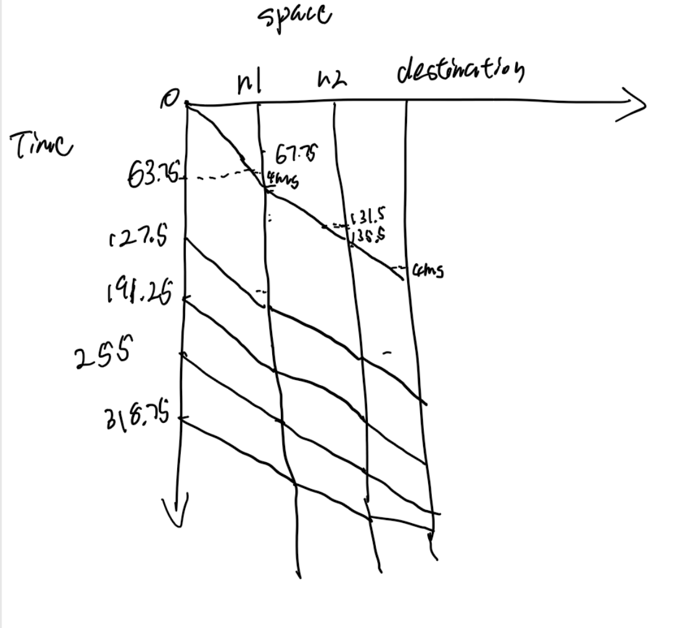

### Northeastern University  
**Khoury College of Computer Sciences**  
**CS 5700 – Fundamentals of Computer Networking**  
**Assignment 1**  
**Due Monday September 23, 2024 at 11:59 pm on Canvas.**  

In all parts of the questions, explain clearly your thoughts. Writing equations and manipulating numbers are not enough to get the full grade.  

---

### Question 1: Individual  

In packet switching with **store-and-forward**, a packet needs to be received in full at a switching node or router before it can be placed on an outgoing link and transmitted. In **cut-through switching**, as soon as the header is received, the outgoing link can be determined, and if it is free, transmission can start immediately on that link.  

Consider a linear path consisting of:  
- a source host,  
- a destination host,  
- 2 intermediate switches/routers, and  
- 3 intermediate links.  

The source has 6 packets of size 8,000 bits each. The source adds a 160-bit header to each packet. All the intermediate links have a propagation delay of 4 msec and a bit rate of 128 Kbps. Neglect queuing delays at the intermediate switches/routers.

#### a)  
If transmission of the packets starts at time = 0, at what time instant are the 6 packets received at the destination host, if packet switching with **store-and-forward** is used? Show the space-time graph.

**a) Store-and-Forward Packet Switching**

Given:
- Packet size = 8,000 bits
- Header = 160 bits
- Total packet size = 8,160 bits per packet
- Propagation delay per link = 4 msec
- Bit rate = 128 Kbps = 128,000 bits/sec

#### **Calculations**:
- **Transmission time per packet**:

  - **Transmission Time**:
$$
\text{Transmission Time} = \frac{\text{Total Packet Size}}{\text{Bit Rate}} = \frac{8,160 \text{ bits}}{128,000 \text{ bits/sec}} = 0.06375 \text{ sec} = 63.75 \text{ msec}
$$
- **Total time for one packet to reach the destination**:
$$
\text{Total Time} = (\text{Transmission Time} + \text{Propagation Delay}) \times \text{Number of Links} = (63.75 \text{ msec} + 4 \text{ msec}) \times 3 = 203.25 \text{ msec}
$$
- **Time for all 6 packets**:
Since each packet starts after the previous has been transmitted, total time will be:
$$
\text{Start Time of Last Packet} = \text{Transmission Time} \times (6 - 1) = 63.75 \text{ msec} \times 5 = 318.75 \text{ msec}
$$
Adding the time taken for the last packet to reach:
$$
\text{Total Time for 6 Packets} = 318.75 \text{ msec} + 203.25 \text{ msec} = 522 \text{ msec}
$$

#### **Space-Time Diagram**:

#### b)  
If transmission of the packets starts at time = 0, at what time instant are the 6 packets received at the destination host, if **cut-through switching** is used? 
**Hint**: A similar example is solved in Module 1 lecture file.

### b) Cut-Through Packet Switching

In **cut-through switching**, the router only needs to receive the 160-bit header before starting the forwarding process. Therefore, the total delay is reduced as routers no longer wait for the entire packet to arrive before starting transmission.

#### Calculations:

### b) Cut-Through Packet Switching

In **cut-through switching**, the router only needs to receive the **160-bit header** before starting the forwarding process. Thus, each router starts transmitting the packet as soon as it receives the header, without waiting for the entire packet. Let's break down the calculation based on the provided formula:

#### Given:
- **Packet size** = 8,000 bits
- **Header** = 160 bits
- **Total packet size** = 8,160 bits
- **Propagation delay per link** = 4 msec
- **Bit rate** = 128 Kbps = 128,000 bits/sec

#### Formula:
The total time for all 6 packets to reach the destination using cut-through switching is given by:
$$
6 \cdot t_{tr} + 3 \cdot t_{pr} + 2 \cdot \frac{\text{Header}}{\text{Bit Rate}}
$$

#### Step-by-Step Breakdown:

1. **Transmission time per packet ($t_{tr}$)**:
   $$
   t_{tr} = \frac{8,160 \text{ bits}}{128,000 \text{ bits/sec}} = 0.06375 \text{ sec} = 63.75 \text{ msec}
   $$

2. **Propagation delay ($t_{pr}$)**: Each link has a propagation delay of 4 msec, and the packet travels through 3 links:
   $$
   3 \cdot t_{pr} = 3 \cdot 4 \text{ msec} = 12 \text{ msec}
   $$

3. **Header transmission time**: The header is 160 bits, and it is transmitted at 128 Kbps:
   $$
   \frac{160 \text{ bits}}{128,000 \text{ bits/sec}} = 0.00125 \text{ sec} = 1.25 \text{ msec}
   $$
   Since two routers are involved, the total header transmission time is:
   $$
   2 \cdot 1.25 \text{ msec} = 2.5 \text{ msec}
   $$

#### Final Calculation:
Now, we combine all the components:
$$
6 \cdot t_{tr} + 3 \cdot t_{pr} + 2 \cdot \frac{160 \text{ bits}}{128,000 \text{ bits/sec}} = 6 \cdot 63.75 \text{ msec} + 12 \text{ msec} + 2.5 \text{ msec}
$$
$$
= 382.5 \text{ msec} + 12 \text{ msec} + 2.5 \text{ msec} = 397 \text{ msec}
$$

Thus, using **cut-through switching**, the 6 packets will be received at the destination after **397 msec**.

3. **Time for all 6 packets:**

The first packet arrives at 15.75 msec, and the remaining packets follow consecutively. Since packets are transmitted back-to-back, the total time to receive all 6 packets can be calculated as:
$$
\text{Total time for 6 packets} = 15.75 \text{ msec} + 5 \times t_{tr} = 15.75 \text{ msec} + 5 \times 63.75 \text{ msec} = 15.75 + 318.75 = 334.5 \text{ msec}
$$

Thus, using **cut-through switching**, the **6 packets will be received at the destination at 334.5 msec**.

---

### Question 2: Individual  

Compute the total time required to transfer (from time = 0 to the time instant at which the last bit of the file is received at the destination) an 8 MB file in the following cases, assuming:  
- the link length is 160,800 Km,  
- a frame size of 1000 Bytes to which a header of 25 Bytes is added.  

Consider the packet size to be the frame size plus the header size. The link bit rate is 40 Mbps and the signal speed is 0.67 times the speed of light (speed of light = $3 \times 10^8$ m/s).

#### a)  
Data packets can be sent continuously back-to-back.
## **Given Parameters**

- **Link length:** $160,800 \, \text{km} = 160,800,000 \, \text{m}$
- **Frame size:** $1000 \, \text{Bytes}$
- **Header size:** $25 \, \text{Bytes}$
- **Packet size:** $1000 + 25 = 1025 \, \text{Bytes}$
- **Link bit rate:** $40 \, \text{Mbps} = 40,000,000 \, \text{bits/s}$
- **Signal speed:** $0.67 \times 3 \times 10^8 \, \text{m/s} = 2.01 \times 10^8 \, \text{m/s}$
- **File size:** $8 \times 10^6 \, \text{Bytes}$

---

### **Basic Calculations**

1. **Signal Propagation Speed:**
   $$
   v = 0.67 \times 3 \times 10^8 = 2.01 \times 10^8 \, \text{m/s}
   $$

2. **Propagation Delay (\(d_{\text{prop}}\)):**
   $$
   d_{\text{prop}} = \frac{\text{Distance}}{\text{Speed}} = \frac{160,800,000}{201,000,000} \approx 0.8 \, \text{seconds}
   $$

3. **Packet Size in Bits:**
   $$
   \text{Packet size} = 1025 \times 8 = 8200 \, \text{bits}
   $$

4. **Transmission Time per Packet (\(d_{\text{trans}}\)):**
   $$
   d_{\text{trans}} = \frac{\text{Packet size in bits}}{\text{Bit rate}} = \frac{8200}{40,000,000} = 0.000205 \, \text{seconds}
   $$

5. **Total Number of Packets:**
   $$
   \text{Number of packets} = \frac{\text{File size}}{\text{Frame size}} = \frac{8,000,000}{1000} = 8000 \, \text{packets}
   $$

---

## **a) Continuous Transmission**

In this scenario, packets are sent back-to-back without waiting for acknowledgments.

1. **Total Transmission Time (\(T_{\text{trans}}\)):**
   $$
   T_{\text{trans}} = \text{Number of packets} \times d_{\text{trans}} = 8000 \times 0.000205 = 1.64 \, \text{seconds}
   $$

2. **Total Time Required (\(T_{\text{total}}\)):**
   $$
   T_{\text{total}} = T_{\text{trans}} + d_{\text{prop}} = 1.64 + 0.8 = \textbf{2.44 seconds}
   $$

#### b)  
A data packet can only be sent after receiving a response for the previous one (assume the response is very small and therefore its transmission time is negligible). The sender does not need to wait after the last packet is sent.
## **b) Stop-and-Wait Transmission**

In this scenario, the sender waits for an acknowledgment after each packet.

1. **Round-Trip Time (RTT):**
   $$
   \text{RTT} = 2 \times d_{\text{prop}} = 1.6 \, \text{seconds}
   $$

2. **Time per Packet:**
   $$
   T_{\text{packet}} = d_{\text{trans}} + \text{RTT} = 0.000205 + 1.6 = 1.600205 \, \text{seconds}
   $$

3. **Total Time Required (\(T_{\text{total}}\)):**
   $$
   T_{\text{total}} = \text{Number of packets} \times T_{\text{packet}} = 8000 \times 1.600205 = \textbf{12,801.64 seconds}
   $$

#### c)  
Up to 10 packets can be sent at a time. The sender cannot send any additional packets until it receives a response for the previous transmission.
Here, the sender can send up to 10 packets before needing an acknowledgment.

1. **Number of Batches:**
   $$
   \text{Number of batches} = \frac{\text{Number of packets}}{10} = \frac{8000}{10} = 800 \, \text{batches}
   $$

2. **Time per Batch:**
   $$
   T_{\text{batch}} = (10 \times d_{\text{trans}}) + \text{RTT} = (10 \times 0.000205) + 1.6 = 0.00205 + 1.6 = 1.60205 \, \text{seconds}
   $$

3. **Total Time Required (\(T_{\text{total}}\)):**
   $$
   T_{\text{total}} = \text{Number of batches} \times T_{\text{batch}} = 800 \times 1.60205 = \textbf{1,281.64 seconds}
   $$

---

### Question 3: Individual  

Jane writes the URL of a web page in her browser. The IP address of the corresponding web server is not cached in your local host, so a **DNS lookup** is necessary to obtain the IP address. Suppose that 4 DNS servers are visited before your host receives the IP address from DNS. The successive visits to these DNS servers incur propagation delays of 0.4 msec, 0.5 msec, 0.6 msec, and 0.8 msec, respectively.  

Suppose the web page requested consists of one packet. The length of the link separating Jane’s host from the server containing the object is 600 Km, and the signal travels at the speed of light.  

#### a)  
What is the time needed to get the IP address of the web server?

### Part (a) - Time Needed to Get the IP Address:

**Given:**
- Jane's DNS request involves visiting 4 DNS servers with propagation delays as follows:
  - Server 1: 0.4 msec
  - Server 2: 0.5 msec
  - Server 3: 0.6 msec
  - Server 4: 0.8 msec

**Analysis:**
- DNS lookups involve a round-trip time (RTT) to and from each DNS server.

**Calculation:**
For each DNS server, the round-trip time is twice the propagation delay:
$$
\text{Server 1 RTT} = 0.4 \, \text{msec} \times 2 = 0.8 \, \text{msec}
$$
$$
\text{Server 2 RTT} = 0.5 \, \text{msec} \times 2 = 1.0 \, \text{msec}
$$
$$
\text{Server 3 RTT} = 0.6 \, \text{msec} \times 2 = 1.2 \, \text{msec}
$$
$$
\text{Server 4 RTT} = 0.8 \, \text{msec} \times 2 = 1.6 \, \text{msec}
$$

**Total DNS Time:**
$$
\text{Total DNS Time} = 0.8 \, \text{msec} + 1.0 \, \text{msec} + 1.2 \, \text{msec} + 1.6 \, \text{msec} = 4.6 \, \text{msec}
$$

#### b)  
Suppose the webpage references 10 small objects on the same server. Neglecting transmission times, and assuming persistent HTTP is used with 4 parallel connections, find the total time elapsed from the moment Jane requests the webpage to the moment she receives the webpage and all 10 objects.

### Step-by-Step Calculation:

#### 1. **DNS Time:**
The DNS lookup time was calculated earlier as:
$$
\text{DNS Time} = 4.6 \, \text{ms}
$$

#### 2. **Connection Time:**
- The distance between Jane's host and the web server is 600 km, and the signal travels at the speed of light ($3 \times 10^8 \, \text{m/s}$).
- The one-way propagation delay is:
$$
\text{One-way propagation delay} = \frac{600,000 \, \text{meters}}{3 \times 10^8 \, \text{meters/second}} = 0.002 \, \text{seconds} = 2 \, \text{ms}
$$
- Therefore, the round-trip time (RTT) for the TCP connection is:
$$
\text{RTT} = 2 \times 2 \, \text{ms} = 4 \, \text{ms}
$$

#### 3. **Fetching Time:**
- Jane needs to fetch 11 objects (1 webpage + 10 small objects) using 4 parallel connections.
- This requires:
$$
\text{Number of rounds} = \lceil \frac{11}{4} \rceil = 3 \, \text{rounds}
$$
- Each round takes one RTT, so the total fetching time is:
$$
\text{Fetching Time} = 3 \times 4 \, \text{ms} = 12 \, \text{ms}
$$

### Total Time:
The total time to retrieve the webpage and all associated objects is the sum of the DNS time, connection time, and fetching time:
$$
\text{Total Time} = \text{DNS Time} + \text{Connection Time} + \text{Fetching Time}
$$
$$
\text{Total Time} = 4.6 \, \text{ms} + 4 \, \text{ms} + 12 \, \text{ms} = 20.6 \, \text{ms}
$$

### Conclusion:
The total time from when Jane requests the webpage to when she receives the webpage and all 10 objects is approximately:
$$
\boxed{20.6 \, \text{milliseconds}}
$$

