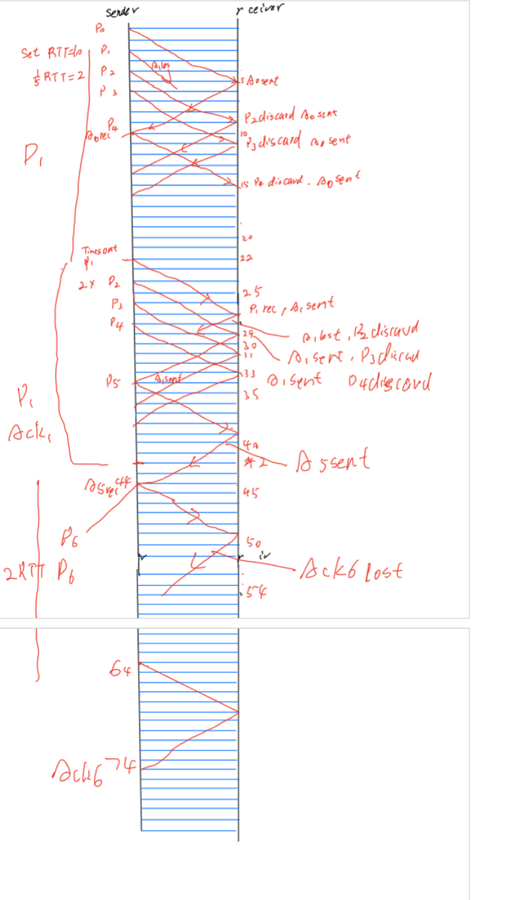
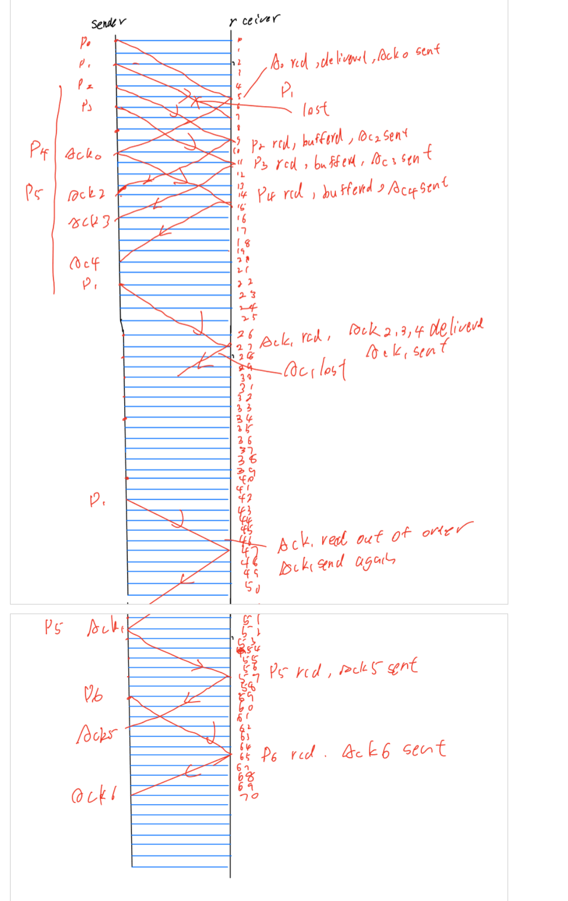

The given problem states that:

- The data frames carry a **useful payload** of size **10,000 bits**.
- Both ACK and data frames have **400 bits of header information**.

The **payload size** refers to the actual data being transmitted, excluding the header information. Therefore, the **10,000 bits** is the size of the **useful payload only** and **does not include the header information**.

To calculate the **total frame size**, you need to add the **400 bits of header** to the **10,000 bits of payload**:

So, the **total size** of each data frame is **10,400 bits**, while the **payload** alone is **10,000 bits**.

# Problem 1: Effective Data Throughput

## **Given:**
- **Link Capacity:** 400 Kbps (both directions, full-duplex)
- **End-to-End Delay:** 3 seconds (one-way), hence Round-Trip Time (RTT) = 6 seconds
- **Data Frame:**
  - **Payload:** 10,000 bits
  - **Header:** 400 bits
  - **Total Data Frame Size:** 10,400 bits
- **ACK Frame:**
  - **Header:** 400 bits
  - **Payload:** 0 bits
  - **Total ACK Frame Size:** 400 bits

## **Definitions:**
- **Transmission Time (\( T_{\text{trans}} \)):** Time to send all bits of a frame.
  $$
  T_{\text{trans}} = \frac{\text{Frame Size (bits)}}{\text{Link Capacity (bps)}}
  $$
- **Effective Throughput:** Ratio of useful data sent to the total time taken (from sending data to receiving ACK).

---

### **Part a) Stop and Wait Protocol**

**Step 1: Calculate Transmission Times**

1. **Data Frame Transmission Time (\( T_{\text{trans\_data}} \)):**
   $$
   T_{\text{trans\_data}} = \frac{10,400 \text{ bits}}{400,000 \text{ bps}} = 0.026 \text{ seconds} \ (\text{26 ms})
   $$
   
2. **ACK Frame Transmission Time (\( T_{\text{trans\_ACK}} \)):**
   $$
   T_{\text{trans\_ACK}} = \frac{400 \text{ bits}}{400,000 \text{ bps}} = 0.001 \text{ seconds} \ (\text{1 ms})
   $$

**Step 2: Total Time Per Frame**

In the Stop and Wait protocol, the total time to send one frame and receive its acknowledgment is the sum of:
- **Data Frame Transmission Time**
- **Round-Trip Time (RTT)**
- **ACK Frame Transmission Time**

Thus,
$$
\text{Total Time} = T_{\text{trans\_data}} + \text{RTT} + T_{\text{trans\_ACK}} = 0.026 \text{ s} + 6 \text{ s} + 0.001 \text{ s} = 6.027 \text{ seconds}
$$

**Step 3: Calculate Effective Throughput**

Effective throughput is the ratio of useful data sent to the total time taken.
$$
\text{Throughput} = \frac{\text{Useful Data}}{\text{Total Time}} = \frac{10,000 \text{ bits}}{6.027 \text{ s}} \approx 1,659 \text{ bps}
$$

**Final Answer:**
- **Effective Data Throughput using Stop and Wait:** Approximately **1,659 bits per second (bps)**

---

### (b) Sliding Window Protocol with \( W = 5 \)

In a sliding window protocol, the sender can transmit \( W \) frames before needing ACKs.

1. **Total transmission time for \( W \) frames:**

   $$
   T_{\text{tx}} = W \times T_d = 5 \times 0.026 = 0.13 \text{ seconds}
   $$

2. **Time when the last data frame is fully transmitted:**

   $$
   T_{\text{last\_data\_sent}} = 0.13 \text{ seconds}
   $$

3. **Time when the last ACK is received:**

   $$
   T_{\text{last\_ACK\_received}} = T_{\text{last\_data\_sent}} + 2T_p + T_a = 0.13 + 6 + 0.001 = 6.131 \text{ seconds}
   $$

4. **Total useful data sent:**

   $$
   \text{Total useful data} = W \times P = 5 \times 10,000 = 50,000 \text{ bits}
   $$

5. **Effective throughput \( \eta \):**

   $$
   \eta = \frac{\text{Total useful data}}{\text{Total time}} = \frac{50,000 \text{ bits}}{6.131 \text{ seconds}} \approx 8155.28 \text{ bits per second}
   $$

