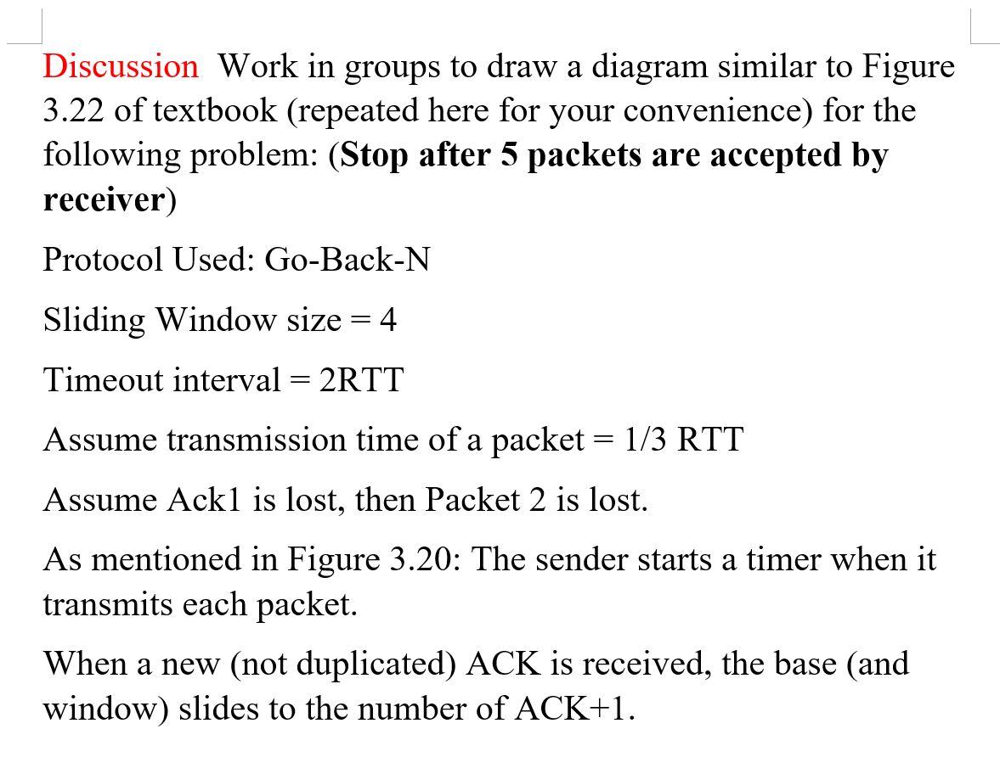
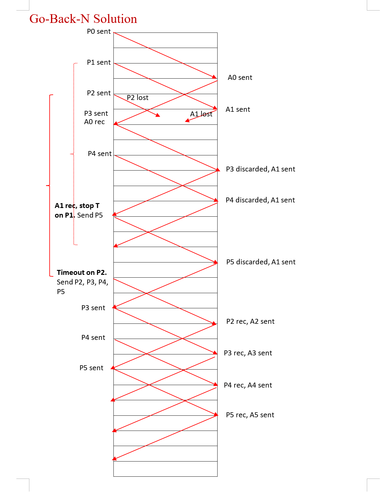
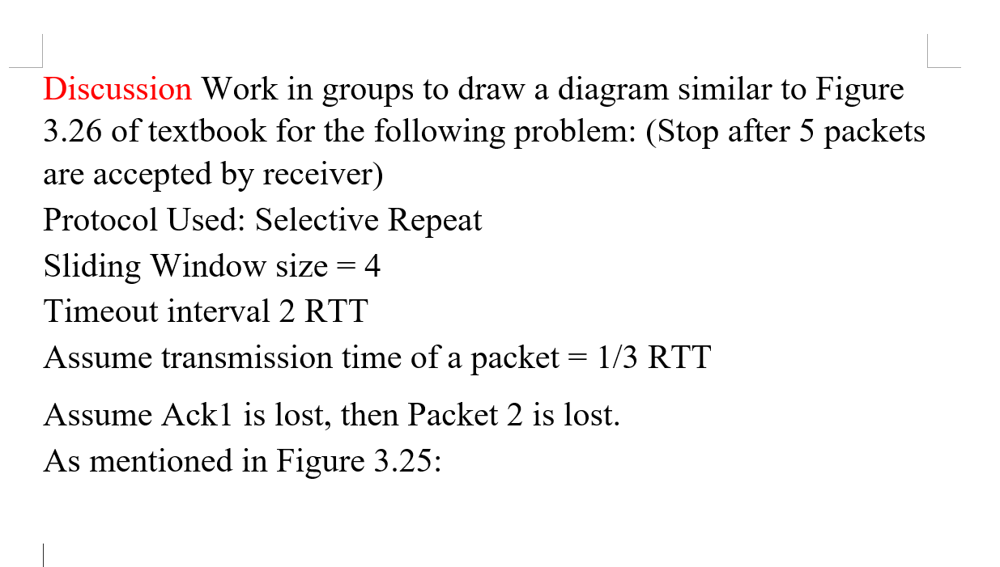
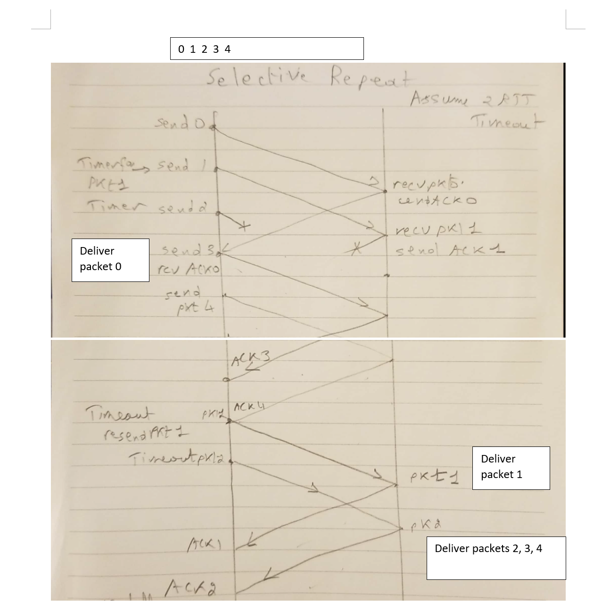

### **相同点**：
1. **超时机制**：无论是 **P1 丢失** 还是 **ACK1 丢失**，发送方都会等待 **2RTT** 后重传 **P1**。
2. **重传 P1**：在超时后，发送方都会认为 **P1 没有被正确接收**，因此重传 **P1**。
3. **发送方无法区分丢失类型**：发送方无法区分是数据包丢失还是确认丢失，因此采取相同的重传行为。

### **不同点**：
1. **P1** 丢失时：接收方会不断重发 **ACK0**，因为它没有收到 **P1**。
2. **ACK1** 丢失时：接收方会不断重发 **ACK1!!!!**，因为它已经收到 **P1**，但 ACK1 丢失了。
3. **接收方的行为**：在 **P1 丢失时**，接收方从未接收过 P1；而在 **ACK1 丢失时**，接收方已经接收了 P1。

你是对的，P5 应该在时间 **34** 发送，而不是 39。在这种情况下，具体情况如下：

1. **P5 在时间 34 发送**，并经过传播延迟 (RTT/2 = 5)，所以 P5 在时间 **39** 到达接收方。
   
2. **接收方发现 P5 不按序到达**，因为 P1 之前丢失并且 P1 的 ACK 还没有确认接收。因此，接收方会丢弃 P5。

3. **接收方返回的是 ACK1**，因为接收方目前还没有收到 P1 的确认包，不能按序处理 P5。

### 重要说明：
- 接收方必须确保所有包按照序号顺序到达，只有在按序接收到 P1 及之前的包后，才会接受 P5。

是的，**发送方不必再次确认 ACK2、ACK3、ACK4**。当发送方在 **时间 44** 收到 ACK5 时，这个 ACK5 隐含了对 **P2、P3、P4** 的确认，因为滑动窗口协议允许在收到更高序号的 ACK 后，隐式确认所有顺序包。因此，发送方可以认为在 ACK5 到达时，之前所有按顺序发送的包（P2、P3、P4）都已经成功接收并确认。

### 总结：
- **ACK5** 的到达隐式确认了 **P2、P3、P4**，所以发送方不需要单独等待它们的 ACK。

在 **Go-Back-N** 协议中，接收方的行为和发送方的理解有一些关键点：

所以除了p1的时间段那个A1 sent 那个sender没有收到 但是 其他的A1其实有收到，所以一直发送A1 其实是因为接受方没有收到A2，然后收到的一直都以为是A1

4. **A1 的重复发送与 A2 的关系**：
   - 不是接收方**以为收到的是 A1**，而是接收方实际并没有发送 A2，因为它**没有收到 P2**。
   - 接收方只有在**按顺序接收到 P2** 后，才会发送 **A2**（确认 P2 的 ACK）。
   - 因为 **P2 丢失了**，所以接收方一直没有机会发送 A2，只能不断重发它最后成功接收到的数据包的确认，即 **A1**。

### 核心点：
- 发送方一直没收到 **A1**，所以它不会向前移动窗口，也不会继续发送新包。
- **接收方之所以一直发送 A1**，是因为它在**丢失 P2 的情况下**，只能确认 **P1**，并等待 P2 的重传。在接收方看来，顺序没有正确，所以它只能继续重发**最后确认的数据包**（P1）的 ACK。
- 一旦接收方收到重传的 **P2** 后，它会停止发送 A1，改为发送 **A2**，确认 P2。

所以，接收方**并不是把后来的 ACK 当成是 A1**，而是因为它没收到 P2，所以它无法发送 A2，必须一直重发 A1。

是的，**P0 被确认**后，窗口会**滑动**，这使得发送方能够继续发送 **P4**。在 **Go-Back-N 协议**中，窗口的滑动依赖于成功接收到的 ACK（确认）。

### 关键点：
- **P0 的确认（ACK0**使窗口向前滑动，使得发送方可以继续发送 **P4**。
- **窗口滑动**的原理是，每当发送方收到新的 ACK 时，窗口就会前移，并允许发送新的包。
- 尽管 **P1 和 P2** 有丢失和确认问题，**P0** 的确认足以使窗口滑动，从而使发送方可以发送 **P4**。

因此，**P4 能被发送**是因为 **P0 已被确认（ACK0）**，窗口向前滑动了一位，允许发送方在窗口限制内继续发送新的数据。

**是的，P5 能被发送是因为 P1 被确认了**。在 **Go-Back-N 协议**中，当发送方收到一个新的确认（ACK）时，窗口会滑动，这允许发送方发送更多的数据包。具体来说，**P5 的发送**依赖于 **P1 的确认**，从而使窗口滑动，腾出空间来发送 P5。

### 详细解释：

1. **初始发送 P0 到 P3**：
   - 发送方首先发送 **P0、P1、P2 和 P3**，因为滑动窗口的大小是 4，允许发送方在没有确认的情况下连续发送 4 个数据包。

2. **P0 确认后，窗口滑动**：
   - 接收方成功接收 **P0** 后，发送 **ACK0** 给发送方。
   - 发送方收到 **ACK0** 后，窗口从 **[P0, P1, P2, P3]** 滑动到 **[P1, P2, P3, P4]**，这使得发送方可以发送 **P4**。

3. **P1 确认后，窗口进一步滑动**：
   - 当接收方成功接收 **P1** 后，发送方会收到 **ACK1**。
   - 发送方收到 **ACK1** 后，窗口进一步滑动，从 **[P1, P2, P3, P4]** 滑动到 **[P2, P3, P4, P5]**，这使得发送方可以发送 **P5**。
   - 因此，**P5 能够被发送**的前提是发送方收到了 **P1 的确认**（即 **ACK1**）。

4. **P2 丢失的影响**：
   - 由于 **P2 丢失**，接收方不会确认 **P2**，并且无法按顺序接收后续的 **P3 和 P4**。
   - 但因为 **P1 已被确认**，发送方能够在窗口滑动后继续发送 **P5**。

### 总结：
- **P5 能被发送**的原因是发送方收到了 **P1 的确认**，使得窗口能够滑动并允许发送方发送新的数据包。
- 每当发送方收到一个新的 ACK，窗口都会滑动，释放一个新的位置以便发送方可以发送下一个数据包。

在你的图中，基于Go-Back-N协议的假设有如下几点：

1. **滑动窗口大小** = 4：
   - 这意味着发送方最多可以同时发送4个数据包，而不需要等待确认。发送窗口控制了发送方可以不等待ACK而连续发送的数据包数量。

2. **超时间隔** = 2RTT：
   - 每个数据包在发送后，如果在2个RTT（Round-Trip Time，往返时延）内没有收到相应的确认ACK，发送方将触发超时并重传丢失的数据包。RTT定义了从发送方到接收方然后再从接收方返回发送方的往返延迟。

3. **计时器启动**：
   - 当数据包的最后一位比特被发送时，发送方会启动计时器来监控是否会收到相应的ACK。计时器的作用是确保在丢失数据包的情况下能够触发重传机制。

4. **数据包的传输时间** = 1/5 RTT：
   - 传输数据包的时间是RTT的1/5，这指的是将整个数据包从发送方传输到接收方所需的时间。

5. **传播延迟** = RTT/2：
   - 传播延迟从发送方到接收方（或从接收方到发送方）为RTT的1/2。这个假设表示，单向传输所需的时间是半个RTT。

6. **ACK消息**：
   - 对于每个数据包，接收方在完全接收到数据包后会发送一个ACK消息，例如数据包P0的ACK叫做ACK0，数据包P1的ACK叫做ACK1，以此类推。

7. **丢包情况**：
   - **P1丢失**：发送方发送P1后，P1在传输过程中丢失，接收方没有收到它。
   - **ACK1丢失**：接收方对成功收到的数据包P1的确认ACK1在传输过程中丢失，发送方没有收到它。
   - **ACK6丢失**：同样，数据包P6的确认ACK6也在传输过程中丢失。

8. **ACK发送机制**：
   - 接收方在接收到数据包的最后一个比特之后会立即发送ACK，但图中忽略了ACK的传输时间，因为相对于数据包的大小，ACK通常非常短小。

这些假设共同定义了在Go-Back-N协议下如何处理丢失的数据包和确认，以及如何通过超时和重传机制来确保数据的可靠传输。

如果 **ACK6 丢失**，后续情况将如下：

### 1. **发送方没有收到 ACK6**：
   - 发送方在发送数据包 **P6** 后，接收方成功接收了 P6，并发送了 **ACK6**。
   - 但由于 ACK6 在传输过程中丢失，发送方无法确认 P6 已被成功接收。

### 2. **发送方等待 ACK6**：
   - 发送方在没有收到 ACK6 的情况下，无法确认 P6 是否被接收，因此会启动计时器。
   - 如果在超时时间（通常为 2RTT）内没有收到 **ACK6**，发送方会认为 **P6** 可能没有成功到达接收方，或者 ACK 丢失了。

### 3. **发送方重传 P6**：
   - 当超时时间到达时，发送方会重传 **P6**，因为它没有收到 ACK6。
   - 接收方会再次收到 P6，但由于 **Go-Back-N 协议**的特点，接收方已经成功接收到并处理了 P6，因此它会将重传的 **P6** 丢弃，并重新发送 **ACK6**。

### 4. **接收方重发 ACK6**：
   - 当接收方再次收到重传的 P6 时，它会明白这是重传的数据包（因为它已经处理过 P6）。
   - 接收方会重新发送 **ACK6**，通知发送方 P6 已经被成功接收。

### 5. **发送方收到 ACK6 后继续**：
   - 最终，发送方在接收到重发的 ACK6 后，确认 P6 已被成功接收，滑动窗口继续移动，准备发送接下来的数据包（如果有）。

### 总结：
- **ACK6 丢失**不会导致数据包的丢失，只会导致 **P6** 被重传一次。
- 由于 **Go-Back-N 协议**的机制，接收方即使已经接收到 P6，也会丢弃重复的 P6，并且再次发送 **ACK6**。
- **重传只会影响效率**，不会影响数据的正确接收，因为接收方已经处理过 P6。

在 **Go-Back-N** 中，ACK 丢失只会导致重传数据包，而接收方会丢弃重复的数据包，并重新发送 ACK，确保发送方知道它已经正确接收到数据。

