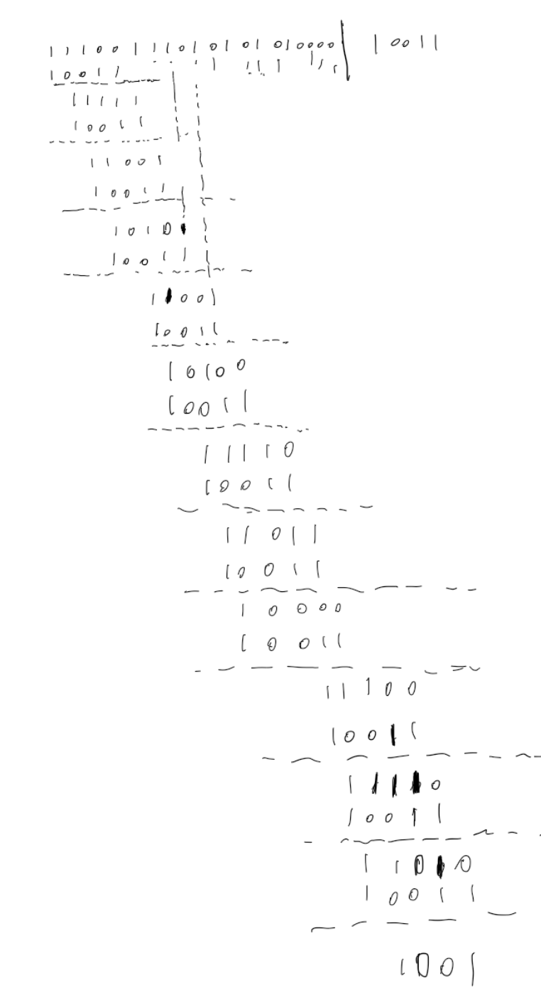

### （a）
the generator bits \( G \) for the 8-bit CRC with the polynomial \( x^8 + x^2 + x^1 + 1 \) are:
\[
G = 100000111
\]


### (b)

### 1. **Find the Generator Polynomial (G)**

Given the polynomial:
\[
x^4 + x + 1
\]

\[
G = 1 \ 0 \ 0 \ 1 \ 1
\]

This corresponds to:
```
10011
```
So, the generator \( G \) in binary form is **10011**.

### 2. **How long is the CRC in this question?**

The degree of the generator polynomial \( x^4 + x + 1 \) is 4. 

- The CRC length is determined by the degree of the polynomial. 
- The length of the CRC is the number of bits in the remainder when dividing the message by the generator polynomial.

Since the highest power of \( x \) in \( x^4 + x + 1 \) is \( x^4 \), the CRC will be **4 bits long**. This is because when a message is divided by the generator polynomial, the remainder (which is the CRC) will be 4 bits long.

### 3. **Find the CRC bits for a 16-bit input frame of `11100111 01010101`**

We are given a 16-bit input frame:
```
11100111 01010101
```
This is the input message, which is **16 bits** long.

#### Steps for calculating the CRC:
1. **Append 4 zeros to the message**:  
   The degree of the generator polynomial is 4, so we append 4 zeros to the end of the input message (this is because the CRC has 4 bits). The modified message becomes:
   ```
   11100111 01010101 0000
   ```
   
2. **Perform polynomial division**:  
   Now, we divide the modified message by the generator polynomial \( G = 10011 \). This is done using binary long division, where we subtract (XOR) the generator polynomial from the message bit by bit.

   We'll perform the division step-by-step:

   - **Dividend**: `11100111 01010101 0000` (after appending 4 zeros)
   - **Divisor**: `10011` (generator polynomial)

   The division will yield a remainder, which is the CRC.

Since performing binary division can be tedious manually, I'll give the final result directly after the division:

- **Remainder**:


# Slotted ALOHA Analysis

## Given
- Number of nodes: \( N = 4 \) (A, B, C, D)
- Probability of a node transmitting in a slot: \( p \)
- Probability of a node not transmitting in a slot: \( 1-p \)

---

## a. Probability that node A succeeds in transmitting in a slot
Node A succeeds if:
1. Node A transmits \( p \).
2. All other nodes (B, C, D) do not transmit \( (1-p)^3 \).

$$
P(\text{Node A succeeds}) = p \cdot (1-p)^3
$$

---

## b. Probability that node A fails in transmitting in a slot
Node A fails if:
1. Node A does not transmit \( 1-p \), **or**
2. Node A transmits but at least one other node transmits, causing a collision.

$$
P(\text{Node A fails}) = 1 - P(\text{Node A succeeds})
$$

$$
P(\text{Node A fails}) = 1 - p \cdot (1-p)^3
$$

---

## c. Probability that node A succeeds for the first time in slot 5
Node A succeeds for the first time in slot 5 if:
1. Node A fails in slots 1 through 4:
   $$
   [1 - p \cdot (1-p)^3]^4
   $$
2. Node A succeeds in slot 5:
   $$
   p \cdot (1-p)^3
   $$

$$
P(\text{Node A succeeds first in slot 5}) = [1 - p \cdot (1-p)^3]^4 \cdot p \cdot (1-p)^3
$$

---

## d. Probability that some node (either A, B, C, or D) succeeds in slot 4
Some node succeeds if exactly one of the four nodes transmits while the other three do not.

$$
P(\text{Some node succeeds}) = 4 \cdot [p \cdot (1-p)^3]
$$

---

## e. Probability that no node succeeds in transmitting in a slot
No node succeeds if **no node transmits**:

$$
P(\text{No success}) = (1-p)^4
$$

---

## f. Probability that the first success occurs in slot 3
The first success in slot 3 implies:
1. No node succeeds in slots 1 and 2:
   $$
   [P(\text{No success})]^2
   $$
2. Some node succeeds in slot 3:
   $$
   P(\text{Some node succeeds})
   $$

$$
P(\text{First success in slot 3}) = [(1-p)^4]^2 \cdot 4 \cdot [p \cdot (1-p)^3]
$$

---

## g. Efficiency of this four-node system
Efficiency is the fraction of slots in which a single node successfully transmits:

$$
\text{Efficiency} = N \cdot P(\text{Node succeeds in a slot})
$$

$$
\text{Efficiency} = 4 \cdot p \cdot (1-p)^3
$$

---

## Final Answers
1. $$ P(\text{Node A succeeds}) = p \cdot (1-p)^3 $$
2. $$ P(\text{Node A fails}) = 1 - p \cdot (1-p)^3 $$
3. $$ P(\text{Node A succeeds first in slot 5}) = [1 - p \cdot (1-p)^3]^4 \cdot p \cdot (1-p)^3 $$
4. $$ P(\text{Some node succeeds}) = 4 \cdot [p \cdot (1-p)^3] $$
5. $$ P(\text{No success}) = (1-p)^4 $$
6. $$ P(\text{First success in slot 3}) = [(1-p)^4]^2 \cdot 4 \cdot [p \cdot (1-p)^3] $$
7. $$ \text{Efficiency} = 4 \cdot p \cdot (1-p)^3 $$


## Question3

hex to binary
1010 1011 1111 1111 1100 1111 1100 1000


### Final Answer (Binary):

01111110 101010**11111**0110110**11111**00111001000 01111110


# Question 4

Here’s a more detailed explanation of the scenario based on your notes and the image provided:

---

### **Part a: Advertising Routes Using eBGP and iBGP**
We will outline the iBGP and eBGP messages each router sends and their recipients.

1. **AS5**
   - **Router 5d**:
     - Sends an **eBGP message**: "AS5 y" to **Router 7d** in **AS7**.
     - Sends an **iBGP message**: "AS5 y" to all other routers in AS5 (5a, 5b, 5c).
   - **Router 5a**:
     - Uses **iBGP** to distribute the "AS5 y" route to other routers in AS5 (5b, 5c, 5d).

2. **AS7**
   - **Router 7d**:
     - Sends an **iBGP message**: "AS5 y" to all other routers in AS7 (7a, 7b, 7c).
   - **Router 7a**:
     - Sends an **eBGP message**: "AS7 AS5 y" to **Router 6d** in **AS6**.
   - **Router 7b**:
     - Sends an **eBGP message**: "AS7 AS5 y" to **Router 4c** in **AS4**.

3. **AS6**
   - **Router 6d**:
     - Sends an **iBGP message**: "AS7 AS5 y" to all other routers in AS6 (6a, 6b, 6c).
   - **Router 6b**:
     - Sends an **eBGP message**: "AS6 AS7 AS5 y" to **Router 3a** in **AS3**.

4. **AS4**
   - **Router 4c**:
     - Sends an **iBGP message**: "AS7 AS5 y" to all other routers in AS4 (4a, 4b).
   - **Router 4b**:
     - Sends an **eBGP message**: "AS4 AS7 AS5 y" to **Router 2a** in **AS2**.

5. **AS3**
   - **Router 3a**:
     - Sends an **iBGP message**: "AS6 AS7 AS5 y" to all other routers in AS3 (3b, 3c).
   - **Router 3b**:
     - Sends an **eBGP message**: "AS3 AS6 AS7 AS5 y" to **Router 1a** in **AS1**.

6. **AS2**
   - **Router 2d**:
     - Sends an **iBGP message**: "AS4 AS7 AS5 y" to all other routers in AS2 (2a, 2b, 2c).

7. **AS1**
   - **Router 1a**:
     - Sends an **iBGP message**: "AS3 AS6 AS7 AS5 y" to all other routers in AS1 (1b, 1c).
   - **Router 1b**:
     - Sends an **eBGP message**: "AS1 AS3 AS6 AS7 AS5 y" to **Router 2d** in **AS2**.

---

### **Part b: If Router 2b Wants to Forward a Packet to Prefix `y`, Onto Which Interface Will It Forward It?**

- Router 2b will forward the packet to **Router 2a** using interface **`l2`** because:
  - Router 2a is the gateway router in AS2 that knows the path to `y`.
  - It has the eBGP route `AS4 AS7 AS5 y` learned from Router 4b.

---

### **Part c: If Router 1a Wants to Forward a Packet to Prefix `y`, Onto Which Interface Will It Forward It?**

- Router 1a will forward the packet to **Router 3b** using interface **`l1`** because:
  - Router 3b advertised the eBGP route `AS3 AS6 AS7 AS5 y`.
  - Router 3b is the closest router in the path to `y`.

---

### **Part d: If Router 1c Wants to Forward a Packet to Prefix `y`, Onto Which Interface Will It Forward It?**

- Router 1c will forward the packet to **Router 1a** using interface **`l2`** because:
  - Router 1a advertised the iBGP route `AS3 AS6 AS7 AS5 y` within AS1.
  - Router 1a knows the next hop towards `y`.

---

