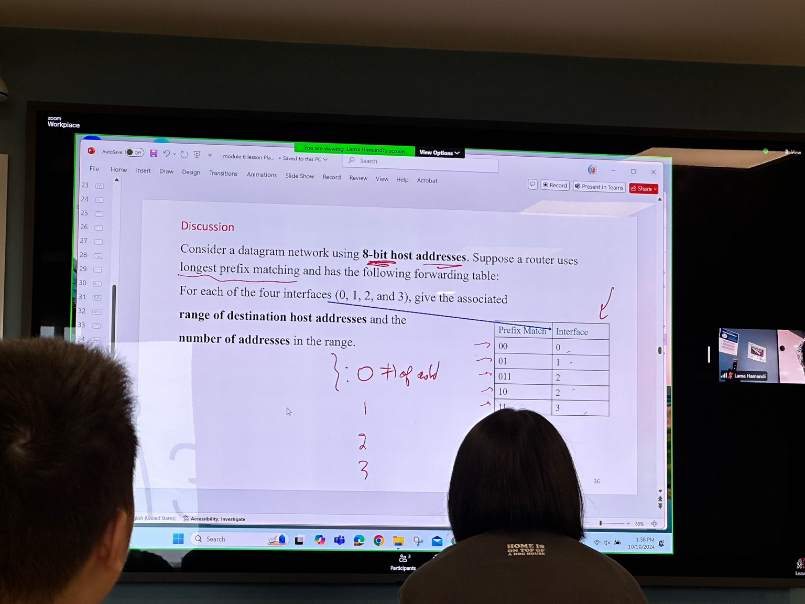

Here’s a table representation based on the longest prefix matching, showing the range of destination host addresses and the number of addresses associated with each interface:

```plaintext
+----------------+------------+---------------------------+---------------------+
| Prefix Match   | Interface  | Range of Host Addresses    | Number of Addresses |
+----------------+------------+---------------------------+---------------------+
| 00             | 0          | 00000000 - 00111111        | 64                  |
| 01             | 1          | 01000000 - 01011111        | 32                  |
| 011            | 2          | 01100000 - 01101111        | 16                  |
| 10             | 2          | 10000000 - 10111111        | 64                  |
| 11             | 3          | 11000000 - 11111111        | 64                  |
+----------------+------------+---------------------------+---------------------+
```

- **Prefix Match**: The bit pattern that determines how the network will route a packet.
- **Interface**: The destination interface for the packet.
- **Range of Host Addresses**: The host address range determined by the prefix match.
- **Number of Addresses**: The total number of addresses in the range, based on the number of bits available after the prefix.

Let me know if you need any adjustments!


因为要区分 011 所以01要加一个0


The second row in the table includes the prefix `011` instead of just `01` for one of the following reasons:

1. **Longest Prefix Matching**: When using longest prefix matching, a more specific prefix match (like `011`) will be chosen over a shorter match (like `01`) if the destination address matches both. This allows the router to send traffic to the correct interface when more specific routing rules are needed.

2. **Specific Routing**: In the case of `011`, it is a more specific subset of `01`. By matching `011`, the router ensures that traffic destined for addresses in the range `01100000 - 01101111` is routed to interface 2, while other addresses with the prefix `01` (e.g., `01000000 - 01011111`) are routed to interface 1.

Thus, adding the more specific prefix `011` ensures proper routing decisions when there is a need to differentiate between addresses that share the same starting bits (`01`).