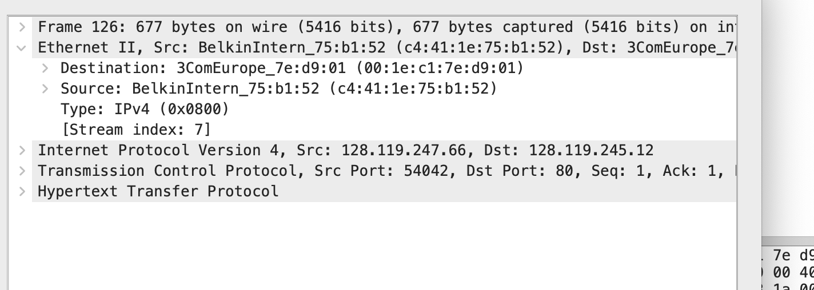
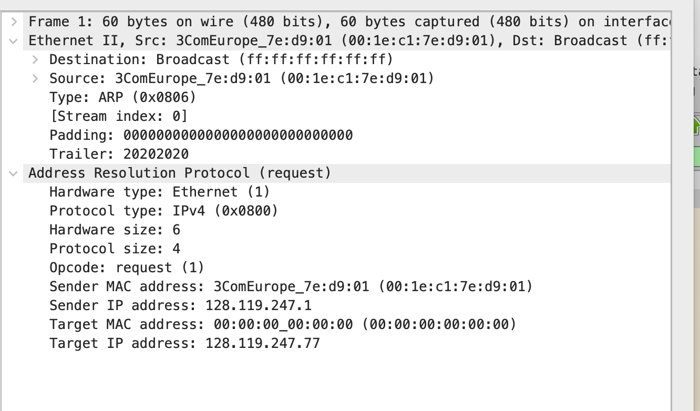
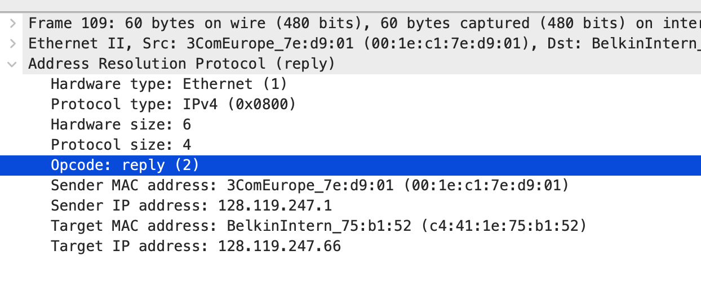
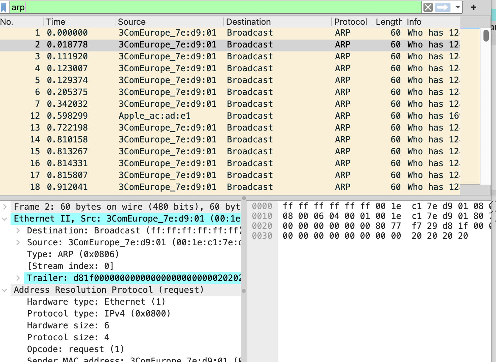
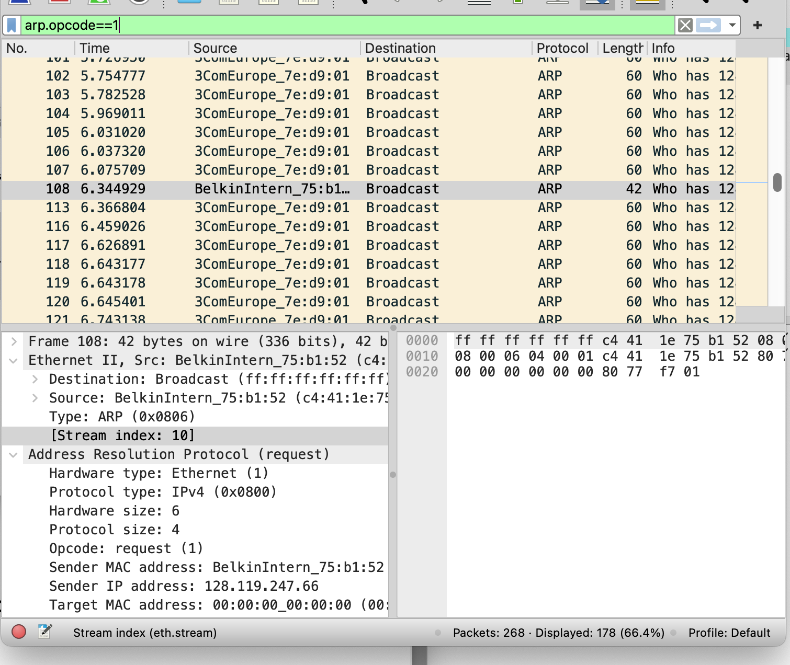

1. **Source MAC Address**: `c4:41:1e:75:b1:52`
2. **Destination MAC Address**: `3ComEurope_7e:d9:01` (or `00:1e:c1:7e:d9:01`)
3. **Hexadecimal Value for Frame Type Field**: `0x0800`
4. **Upper Layer Protocol**: IPv4
5. **Bytes from Start of Ethernet Frame to ASCII "G" in "GET"**: \(4 \times 16 + 3 = 67\)

###  Answers for Part 2:
1. **Hexadecimal Value of Source Address**: `00:1e:c1:7e:d9:01`
2. **Hexadecimal Value of Destination Address**: `ff:ff:ff:ff:ff:ff`
3. **Device Type Corresponding to the Destination Address**: Ethernet
4. **Opcode Field Value**: `1`
5. **Sender's IP Address**: Yes, `128.119.247.1`
6. **Queried IP Address**: 128.119.247.77

### Part 3: ARP Reply Analysis

### Summary of Answers for Part 3:
1. **Opcode Value**: `2`
2. **MAC Address Corresponding to the Requested IP Address**: `c4:41:1e:75:b1:52`
3. **Relation of Reply's Source MAC Address to Request's Destination**: The reply's source MAC address corresponds to the sender of the original request.
4. **IP Addresses Transition**: The sender's IP remains the same, while the target IP address in the reply is the resolved address.

Let's analyze the new image and previous data you've provided to answer the questions for Part 4: Advanced Analysis regarding ARP requests and replies.

### Part 4: Advanced Analysis

### Summary of Answers for Part 4
1. **ARP Requests Count**: 178
2. **ARP Replies Count**: [1]
3. **Unanswered ARP Requests Count**: [177]
4. **ARP Entry Cache Duration**: [60 seconds]
5. **Duplicate ARP Requests**: Yes, there are duplicate ARP requests for specific IP addresses
6. **Broadcast Messages**: ARP requests use broadcast messages. When a device needs to discover the MAC address associated with a specific IP address, it sends an ARP request to the broadcast address ff:ff:ff:ff:ff:ff. This allows all devices on the local network to receive the request and respond if they have the requested IP address.
7. **Unicast Messages**: ARP replies use unicast messages. Once a device receives the ARP request, it replies directly to the MAC address of the device that made the request. This targeted approach ensures that only the requesting device receives the MAC address information it needs.
8. **Importance of Pattern**: Efficiency: Broadcasting allows a device to query the network for the MAC address without needing to know which device it is trying to communicate with. This is essential for dynamic environments where devices frequently change.
Reduced Network Traffic: By sending replies as unicast, the network minimizes unnecessary broadcast traffic. Only the device that sent the ARP request receives the response, reducing congestion and improving performance.
Network Scalability: As networks grow in size, the ability to efficiently resolve IP addresses without excessive broadcast traffic becomes critical for maintaining performance and responsiveness.
Local Communication: This mechanism facilitates efficient communication within a local area network (LAN), allowing devices to quickly learn about each other and interact smoothly.

