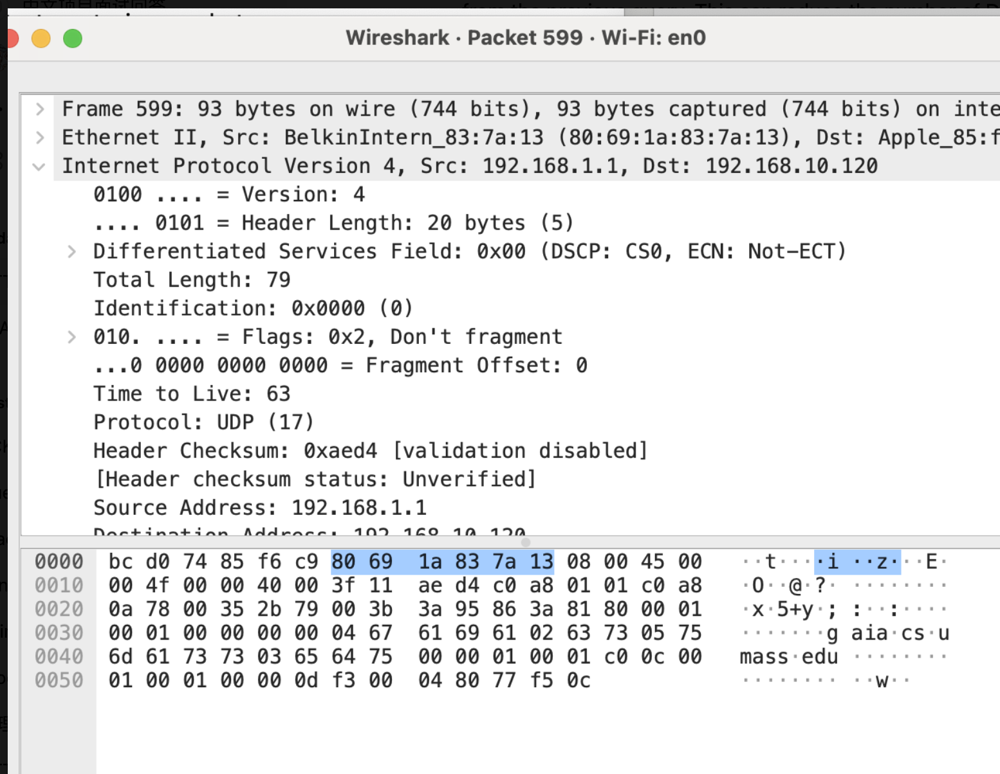
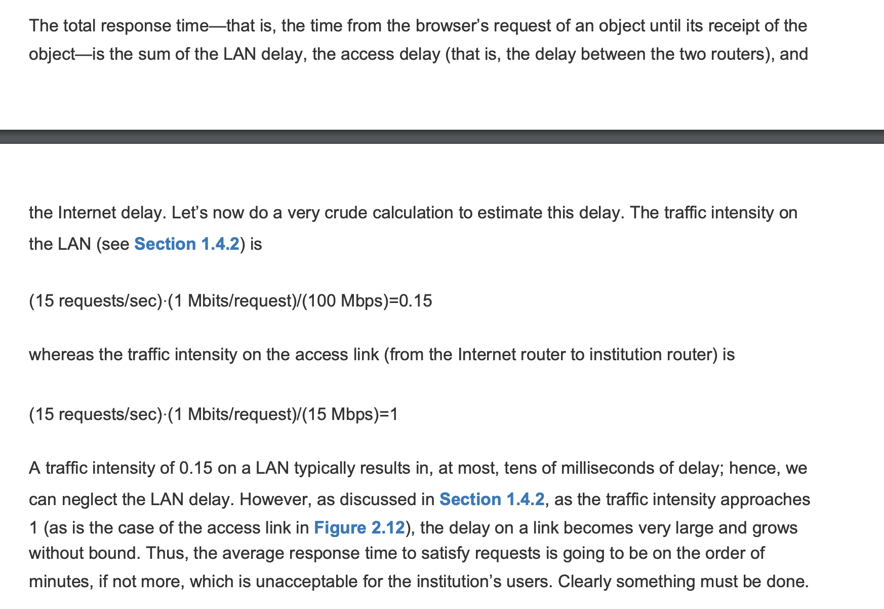
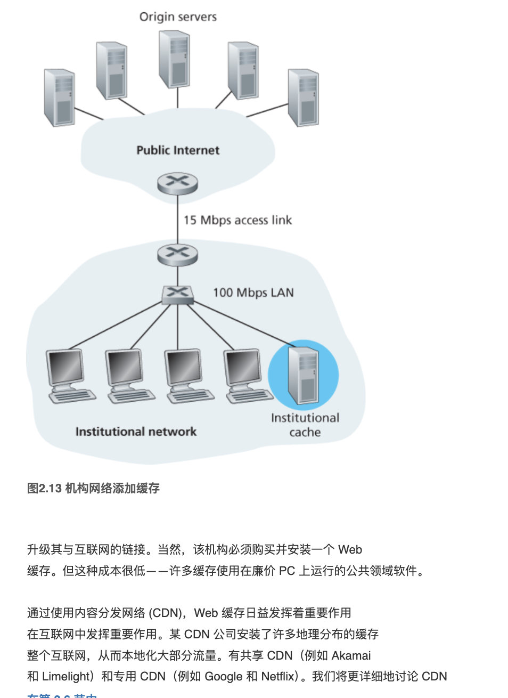
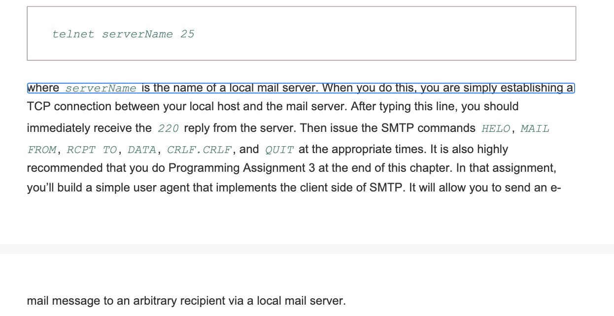

## **Packet Switching (数据包交换)**

To send a message from a source end system to a destination end system, the source breaks long messages into smaller chunks of data known as **packets**. Between the source and destination, each packet travels through communication links and **packet switches**. There are two predominant types of packet switches:

- **Routers**: These devices direct packets between different networks based on IP addresses. Routers analyze the destination address contained in the packet header and make dynamic decisions about the best route for the packet to reach its destination.

- **Link-Layer Switches**: Also known as network switches, these devices handle packets within the same network segment. They operate at the data link layer and use MAC addresses to forward packets to the correct device within the same local network.

Both routers and link-layer switches play crucial roles in managing network traffic efficiently and ensuring that data packets reach their intended destinations reliably.


 if a source end
system or a packet switch is sending a packet of L bits over a link with transmission rate R bits/sec, then
the time to transmit the packet is L /R seconds.


Most packet switches use store-and-forward transmission at the inputs to the links. Store-and-forward
transmission means that the packet switch must receive the **entire packet** before it can begin to transmit
the first bit of the packet onto the outbound link. 


buffer缓存


## 分组交换 (Packet Switching)

**分组交换**是一种网络通信模式，其中数据被分割成多个小的包，每个包独立发送至目的地。这种方式允许多个数据包共享同一网络路径，从而更有效地使用网络资源。

- **优点**：
  - **效率高**：网络可以根据实时流量调整资源分配。
  - **灵活性强**：包可以通过网络中的不同路径独立路由，适应链路故障和拥堵。
  - **成本低**：由于共享网络资源，构建和维护成本相对较低。

- **缺点**：
  - **延迟和抖动**：包的路由可能会导致延迟变化，影响实时应用如语音和视频通信的质量。
  - **需要额外的协议**：为确保数据完整性和顺序，需要额外的网络协议来重组数据包。

## 电路交换 (Circuit Switching)

**电路交换**是一种通信方式，通信双方在数据传输前需要建立一个固定的物理通路。在通信过程中，这条路径被独占使用。

- **优点**：
  - **通信质量稳定**：建立的电路保证了数据传输的连续性和顺序，适合高质量语音和视频通信。
  - **无需额外处理**：数据可以直接发送，无需在终点重新组装。

- **缺点**：
  - **资源利用率低**：即使通信线路暂时未被使用，资源也不能分配给其他用户。
  - **建立时间长**：需要时间建立连接，可能在高需求时造成延迟。

这两种技术各有优缺点，选择哪种技术取决于应用场景的具体需求。


## 存储转发分组交换 (Store-and-Forward Packet Switching)

**存储转发分组交换**是网络通信中使用的一种基本技术，数据包在传输过程中会在每个中继节点（如路由器或交换机）暂存，然后再转发到下一个节点，直至到达最终目的地。

### 工作流程
1. **分包**：发送者的数据被分割成更小、更易管理的数据包。
2. **发送**：每个数据包被发送到网络中的第一个交换机或路由器。
3. **存储**：数据包到达后，会被暂时存储在设备的内存中。
4. **处理**：设备检查数据包的头部信息，以确定其路由路径。
5. **转发**：确定路由后，数据包将被转发到下一个节点。
6. **重复**：此过程在每个中继节点重复，直至数据包到达目的地。

### 主要特点
- **错误检查**：每个节点都可以进行错误检查并处理，增强数据传输的可靠性。
- **拥堵控制**：节点可有效管理网络拥堵，调节数据流。
- **灵活性**：根据当前网络条件和节点可用性，数据包可以通过不同路径路由。

### 优点
- **健壮性**：即使某些路径或节点出现故障，网络仍可继续运行。
- **可扩展性**：可以轻松添加更多节点，并处理增加的数据量，无需在基础设施上进行重大更改。
- **效率**：只有在路径清晰时才发送数据包，优化带宽使用。

### 缺点
- **延迟**：每个节点的存储和处理都会引入延迟。
- **开销**：每个节点需要存储和处理能力，增加了网络设备和运营的成本。
- **带宽使用**：每个数据包必须携带自己的地址和控制信息，略微降低了网络带宽的效率。

存储转发分组交换广泛用于电子邮件传输和互联网上的其他数据通信形式，其中数据的可靠性和灵活性比实时交付更为重要。


 As before, at time L/R, the router begins to forward
the first packet. But also at time L/R the source will begin to send the second packet, since it has just
finished sending the entire first packet. Thus, at time 2L/R, the destination has received the first packet
and the router has received the second packet. Similarly, at time 3L/R, the destination has received the
first two packets and the router has received the third packet. Finally, at time 4L/R the destination has
received all three packets!
Let’s now consider the general case of sending one packet from source to destination over a path
consisting of N links each of rate R (thus, there are N-1 routers between source and destination).
Applying the same logic as above, we see that the end-to-end delay is:
You may now want to try to determine what the delay would be for P packets sent over a series of N
links.

### Queuing Delays and Packet Loss  排队延迟和数据包丢失


Each packet switch has multiple links attached to it. For each attached link, the packet switch has an
output buffer (also called an output queue), which stores packets that the router is about to send into
that link. 每个分组交换机都有多条连接到它的链路。对于每个附加的链路，分组交换机都有一个
输出缓冲区(也称为输出队列)，用于存储路由器即将发送的数据包该链接

The output buffers play a key role in packet switching. If an arriving packet needs to be
transmitted onto a link but finds the link busy with the transmission of another packet, the arriving packet
must wait in the output buffer.Thus, in addition to the store-and-forward delays, packets suffer output
buffer queuing delays. These delays are variable and depend on the level of congestion in the network

### packet lossing

arriving packet may find that the buffer is completely full with other packets waiting for transmission. In
this case, packet loss will occur—either the arriving packet or one of the already-queued packets will
be dropped.到达的数据包可能会发现缓冲区被其他等待传输的数据包完全填满。在
在这种情况下，将发生包丢失——要么是到达的包，要么是已经排队的包之一
被删除。

Suppose Hosts A and B are sending
packets to Host E. Hosts A and B first send their packets along 100 Mbps Ethernet links to the first
router. The router then directs these packets to the 15 Mbps link. If, during a short interval of time, the
arrival rate of packets to the router (when converted to bits per second) exceeds 15 Mbps, congestion
will occur at the router as packets queue in the link’s output buffer before being transmitted onto the link.
主机A和主机B首先将它们的数据包通过100mbps的以太网链路发送给主机e
路由器。然后路由器将这些数据包定向到15mbps的链路。如果，在短时间间隔内，
数据包到达路由器的速率(当转换为每秒比特数时)超过15mbps，出现拥塞
在发送到链路上之前，数据包会在链路的输出缓冲区中排队。
For example, if Host A and B each send a burst of five packets back-to-back at the same time, then
most of these packets will spend some time waiting in the queue. The situation is, in fact, entirely
analogous to many common-day situations—for example, when we wait in line for a bank teller or wait in
front of a tollbooth. We’ll examine this queuing delay in more detail in Section
例如，如果主机A和主机B同时连续发送5个数据包，则
这些数据包中的大多数将在队列中等待一段时间。事实上，情况完全是
类似于

### Forwarding Tables and Routing Protocols

之前，我们说过路由器接收到达其连接的通信链路之一的数据包，并
将该数据包转发到其附加的另一条通信链路上。但路由器如何
确定应将数据包转发到哪个链路？数据包转发实际上是在不同的地方完成的
不同类型的计算机网络中的方式。这里，我们简单描述一下在互联网上是如何完成的。
在互联网中，每个终端系统都有一个称为 IP 地址的地址。
当源端系统
想要将数据包发送到目标端系统，源将目标的 IP 地址包含在
数据包的标头。与邮政地址一样，该地址也具有分层结构。当一个数据包
到达网络中的路由器，路由器检查数据包的目标地址的一部分并
将数据包转发到相邻路由器。更具体地说，每个路由器都有一个转发表
将目标地址（或目标地址的一部分）映射到该路由器的出站链接。
当数据包到达路由器时，路由器检查地址并搜索其转发表，
使用此目标地址来查找适当的出站链接。然后路由器将数据包定向
到此出站链接。

## circuit switching电路交换

在电路交换网络中，沿路径（缓冲区、链路传输速率）所需的资源
提供终端系统之间的通信，并在通信期间保留端系统之间的会话。在分组交换网络中，这些资源没有被保留； session 的消息按需使用资源，因此可能需要等待（即队列）用于访问通信链路。



图 1.13 展示了一个电路交换网络。在该网络中，四个电路交换机通过四个链路互连。每个链路都有四个电路，因此每个链路可以支持四个
同时连接。主机（例如 PC 和工作站）均直接连接
到其中一台交换机。当两台主机想要通信时，网络会建立一个专用的终端——
两台主机之间的端到端连接。因此，为了使主机 A 能够与主机 B 进行通信，
网络必须首先在两条链路上各预留一条电路。在此示例中，专用的端到端
连接使用第一链路中的第二电路和第二链路中的第四电路。因为每个
链路有四个电路，对于端到端连接使用的每个链路，该连接获得四分之一
连接期间链路的总传输容量。因此，例如，如果每个链接
相邻交换机之间的传输速率为 1 Mbps，则每个端到端电路交换机
连接获得 250 kbps 的专用传输速率。

如果传输到网络上：
与电路交换不同的是，数据包被发送到网络中不保留任何链接资源。如果其中一个链路由于其他数据包而拥塞需要同时通过链路传输，那么数据包将不得不在缓冲区中等待传输链路的发送侧并遭受延迟。互联网尽最大努力提供包及时，但不做任何保证。


### Multiplexing in Circuit-Switched Networks电路交换网络中的多路复用
**频分多路复用（FDM）**将链路的频谱分配给跨链路建立的各个连接。每个连接在连接持续期间被分配一个特定的频率带。例如，在电话网络中，这种频率带通常为4 kHz，也被称为带宽。同样，FM广播电台使用FDM在88 MHz至108 MHz之间分配频谱，每个电台被分配一个特定的频率带。divides the frequency spectrum of a link among the various connections established across the link. Each connection is allocated a specific frequency band for the duration of the connection. For instance, in telephone networks, this frequency band typically spans 4 kHz, which is also referred to as the bandwidth. Similarly, FM radio stations utilize FDM to divide the frequency spectrum between 88 MHz and 108 MHz, with each station allocated a specific frequency band.

A circuit in a link is implemented with either frequency-division multiplexing (FDM) or time-division
multiplexing (TDM). 
### 频分多路复用 (FDM)
**频分多路复用（FDM）**将链路的频谱分配给跨链路建立的各个连接。每个连接在连接持续期间被分配一个特定的频率带。例如，在电话网络中，这种频率带通常为4 kHz，也被称为带宽。同样，FM广播电台使用FDM在88 MHz至108 MHz之间分配频谱，每个电台被分配一个特定的频率带。

### 时分多路复用 (TDM)
**时分多路复用（TDM）**涉及将时间分成固定长度的帧，并将每个帧分成固定数量的时间槽。当跨链路建立连接时，网络在每个帧中为这个连接分配一个时间槽。这个专用槽在每个帧中持续使用，以传输连接的数据，确保持续访问介质，不受其他用户的干扰。


对于 TDM，电路的传输速率等于帧速率乘以时隙中的位数。例如，如果链路每传输 8,000 个帧
第二个，每个时隙由8位组成，则每个电路的传输速率为64kbps。

分组交换的支持者一直认为电路交换是浪费的，因为专用电路在静默期间处于空闲状态。例如，当一个人打电话时
停止通话时，空闲的网络资源（沿线链路中的频段或时隙）连接的路由）不能被其他正在进行的连接使用。作为另一个例子来说明这些
资源可能未得到充分利用，考虑放射科医生使用电路交换网络远程访问一系列 X 射线。放射科医生建立连接，请求图像，考虑图像，然后请求新图像。网络资源已分配给连接，但未分配给连接在放射科医生的思考期间使用（即浪费）。分组交换的支持者还喜欢指出建立端到端电路并保留端到端传输容量很复杂，需要复杂的信令软件来协调各设备的操作沿着端到端路径进行切换

让我们考虑一下从 发送一个 640,000 位的文件需要多长时间
主机 A 通过电路交换网络连接到主机 B。假设网络中的所有链路都使用 TDM，24时隙，比特率为 1.536 Mbps。还假设建立端到端的连接需要 500 毫秒主机 A 可以开始传输文件之前的电路。发送文件需要多长时间？各电路传输速率为 ，因此需要几秒的时间才能达到(1.536Mbps)/24=64 kbps，(640,000 位)/(64 kbps)=10
传输文件。在这 10 秒的基础上，我们添加电路建立时间，从而提供 10.5 秒的发送时间
文件。请注意，传输时间与**链路数量**无关： 传输时间
如果端到端电路经过一条链路或一百条链路，则为 10 秒
. Let us consider how long it takes to send a file of 640,000 bits from
Host A to Host B over a circuit-switched network. Suppose that all links in the network use TDM with 24slots and have a bit rate of 1.536 Mbps. Also suppose that it takes 500 msec to establish an end-to-end circuit before Host A can begin to transmit the file. How long does it take to send the file? Each circuithas a transmission rate of so it takes seconds to
transmit the file. To this 10 seconds we add the circuit establishment time, giving 10.5 seconds to sendthe file. Note that the transmission time is independent of the **number of links**: The transmission timewould be 10 seconds if the end-to-end circuit passed through one link or a hundred links.
## Packet Switching Versus Circuit Switching
(1) 与电路交换相比，它提供了更好的传输容量共享；(2) 更简单、更高效与电路交换相比，效率更高且实施成本更低

为什么分组交换效率更高？
让我们看一个简单的例子。假设用户共享 1 Mbps关联。还假设每个用户在活动周期之间交替，当用户在100 kbps 的恒定速率，以及用户不生成数据时的不活动期。进一步假设用户只有 10% 的时间处于活动状态（并且在剩余 90% 的时间里闲着喝咖啡）
的时间百分比）。对于电路交换，必须**始终**为每个用户保留 100 kbps。例如，对于电路交换 TDM，如果一秒帧被分为 10 个时隙，每个时隙为 100 ms，那么每个用户每帧将被分配一个时隙。Suppose users share a 1 Mbps link. Also suppose that each user alternates between periods of activity, when a user generates data at a constant rate of 100 kbps, and periods of inactivity, when a user generates no data. Suppose further that a user is active only 10 percent of the time (and is idly drinking coffee during the remaining 90 percent of the time). With circuit switching, 100 kbps must be reserved for each user at all times. Forexample, with circuit-switched TDM, if a one-second frame is divided into 10 time slots of 100 ms each,then each user would be allocated one time slot per frame.

Thus, the circuit-switched link can support only simultaneous users. With packet
switching, the probability that a specific user is active is 0.1 (that is, 10 percent). If there are 35 users,the probability that there are 11 or more simultaneously active users is approximately 0.0004.使用数据包10（=1 Mbps/100 kbps）
切换时，特定用户处于活动状态的概率为 0.1（即 10%）。如果有35个用户，
有 11 个或更多同时活跃用户的概率约为 0.0004。

当同时活跃用户数为 10 或更少时（概率为 0.9996），数据的总到达率为
小于或等于1 Mbps，链路的输出速率。因此，当活跃用户数为 10 或更少时，
用户的数据包基本上没有延迟地流经链路，就像电路交换的情况一样。什么时候
有超过 10 个同时活动的用户，则数据包的总到达率超过
链路的输出容量，输出队列将开始增长。 （它会持续增长，直到
总输入速率回落至 1 Mbps 以下，此时队列长度将开始缩短。）
因为在这种情况下，同时拥有超过 10 个活跃用户的概率微乎其微。
例如，分组交换提供与电路交换本质上相同的性能，但是这样做
同时允许三倍以上的用户数量

假设有 10 个用户，其中一个用户突然10^6
生成一千个 1,000 位数据包，而其他用户保持静止，不生成
数据包。在每帧 10 个时隙且每个时隙由 1,000 位组成的 TDM 电路交换下，
活动用户每帧只能使用其一个时隙来传输数据，其余 9 个时隙
在每一帧中保持空闲。需要 10 秒，活跃用户的 100 万比特数据才会全部被删除。

在分组交换的情况下，活动用户可以连续地发送其分组
1 Mbps 的全链路速率，因为没有其他用户生成需要的数据包
与活动用户的数据包复用。在这种情况下，所有活跃用户的数据都将被传输
1秒内。

## quesition in class

```
T =  640000
R = 10**6 bits/sec(1Mbs)

transimissionntmie = 640000/(10**6)= 0.64

TDM 20 个等长 的时间片

所以每一个用户只有
1Mbs/20 = 50 Kbps

transmission = 640000/50 = 12800 msc

12.8 seconds

establish the circut

500 msec  毫秒   0.5 seconds


12.8+0.5 = 13.3
```


## Regional ISPs and ISP Points of Presence (PoP)区域ISP和ISP存在点(PoP)

ISP stands for Internet Service Provider.ISP代表互联网服务提供商

### Regional ISPs

**Regional Internet Service Providers (ISPs)** are companies that provide internet access to customers within a specific geographic area. Unlike national ISPs that cover broad areas, regional ISPs typically focus on serving a smaller region, which might be a city, a specific rural area, or a combination of several towns. These ISPs often offer specialized local services and may provide more personalized customer service due to their focus on a smaller customer base.
**区域互联网服务提供商(isp)**是为特定地理区域内的客户提供互联网接入的公司。与覆盖广泛地区的国家互联网服务提供商不同，区域互联网服务提供商通常专注于服务较小的区域，可能是一个城市，特定的农村地区，或几个城镇的组合。这些互联网服务提供商通常提供专门的本地服务，并可能提供更个性化的客户服务，因为他们关注的是较小的客户群

### ISP Points of Presence (PoP)

**ISP Points of Presence (PoPs)** are physical locations within an ISP's network where they house networking equipment such as routers and switches. These PoPs are crucial for connecting different parts of the ISP's network to each other and to the wider internet. A PoP typically includes:
**互联网服务提供商存在点(pop)**是互联网服务提供商网络中的物理位置，它们放置网络设备，如路由器和交换机。这些pop对于将ISP网络的不同部分相互连接并连接到更广泛的互联网至关重要。PoP通常包括

- **Network Devices**: Routers, switches, and sometimes servers that manage network traffic.
- **Access Equipment**: Devices that allow end-users to connect to the internet via various access methods like DSL, cable, or fiber optics.
- **Interconnection Points**: Locations where the ISP's network connects to other networks, including those of other ISPs, to facilitate data exchange.

### Functions of PoPs

- **Traffic Routing**: PoPs route data traffic from customers to the internet, ensuring efficient data transmission across networks.
- **Redundancy and Reliability**: By having multiple PoPs, ISPs can offer more reliable connections with redundancy, reducing the risk of network failures.
- **Performance Optimization**: PoPs allow ISPs to distribute network operations geographically closer to end-users, minimizing latency and improving overall network performance.

### Importance of Regional ISPs and PoPs

Regional ISPs and their PoPs play a vital role in expanding internet access to underserved areas. By focusing on regional services, these ISPs can address specific local connectivity needs, support community initiatives, and contribute to regional economic growth. Additionally, the strategic placement of PoPs helps ensure that even remote areas have reliable internet access, bridging the digital divide.

In summary, regional ISPs and their network of PoPs are essential for delivering efficient, locally-focused internet services, making them key players in the telecommunications industry.
区域互联网服务提供商及其pop在将互联网接入扩展到服务不足的地区方面发挥着至关重要的作用。通过专注于区域服务，这些互联网服务提供商可以满足特定的本地连接需求，支持社区倡议，并为区域经济增长做出贡献。此外，持久性有机污染物的战略性放置有助于确保即使是偏远地区也有可靠的互联网接入，弥合数字鸿沟。总之，区域互联网服务供应商及其持久性有机接入点网络对于提供高效、以本地为重点的互联网服务至关重要，使它们成为电信业的关键参与者。


总之，当今的互联网（网络的网络）非常复杂，由十几个一级网络组成ISP 和数十万低层 ISP。 ISP 的覆盖范围各不相同，其中一些
跨越多个大陆和海洋，还有一些仅限于狭窄的地理区域。较低的-一级 ISP 与上一级 ISP 连接，而上一级 ISP 之间又相互互连。用内容提供商是下层 ISP 的客户，下层 ISP 是上层 ISP 的客户ISP。近年来，各大内容提供商也创建了自己的网络并连接如果可能的话，直接进入较低层的 ISP。


## 1.4 Delay, Loss, and Throughput in Packet-Switched Networks1.4 分组交换网络中的延迟、丢失和吞吐量

### Delay

In packet-switched networks, delay refers to the time it takes for data packets to travel from the source to the destination. Delays can be categorized into several types:

- **Propagation Delay**: The time it takes for a signal to travel from the sender to the receiver, which depends on the physical length of the medium and the speed of signal transmission.
- **Transmission Delay**: The time required to push all the packet's bits into the link, which depends on the packet's length and the link's bandwidth.
- **Processing Delay**: Time taken by routers to process the packet header and make a forwarding decision.
- **Queuing Delay**: Time packets spend waiting in queues at routing nodes, which can vary greatly depending on the network's congestion level.
### 延迟

在数据包交换网络中，延迟指的是数据包从源头到目的地所需的时间。延迟可以分为几种类型：

- **传播延迟**：信号从发送者传送到接收者所需的时间，这取决于传输介质的物理长度和信号的传输速度。
- **传输延迟**：将所有数据包比特推入链路所需的时间，这取决于数据包的长度和链路的带宽。
- **处理延迟**：路由器处理数据包头部并做出转发决策所需的时间。
- **排队延迟**：数据包在路由节点的队列中等待的时间，这在很大程度上取决于网络的拥堵程度。

### Loss

Packet loss occurs when a packet fails to reach its destination. Causes of packet loss include:

- **Buffer Overflow**: When the router's memory buffer is full, incoming packets are dropped.
- **Errors**: Bit errors during transmission can corrupt packets, making them undeliverable.
- **Congestion**: High traffic levels can overwhelm network segments, leading to dropped packets.
### 丢包

当数据包未能到达其目的地时，会发生丢包现象。丢包的原因包括：

- **缓冲区溢出**：当路由器的内存缓冲区满时，新到达的数据包会被丢弃。
- **错误**：传输过程中的比特错误可能会损坏数据包，导致数据包无法被送达。
- **拥堵**：高流量水平可能会使网络部分区域超载，导致数据包被丢弃。
  
### Throughput

Throughput in a packet-switched network is the rate at which data is successfully transferred from one node to another, typically measured in bits per second (bps). Factors affecting throughput include:

- **Network Capacity**: The maximum available bandwidth of the network.
- **Traffic Load**: The amount of data being transmitted over the network at any given time.
- **Packet Loss**: High loss rates can significantly reduce effective throughput as data needs to be retransmitted.
### 吞吐量

数据包交换网络的吞吐量是指从一个节点成功传输到另一个节点的数据速率，通常以比特每秒（bps）为单位衡量。影响吞吐量的因素包括：

- **网络容量**：网络的最大可用带宽。
- **流量负载**：任何给定时间内网络上被传输的数据量。
- **丢包率**：高丢包率会显著降低有效吞吐量，因为需要重新传输数据。

### Impact on Network Performance

- **Delay and Throughput**: These are often in a trade-off relationship. Techniques that reduce delay (such as increasing bandwidth) can improve throughput, but might be costly or difficult to implement.
- **Loss and Throughput**: High packet loss reduces throughput as the necessary retransmissions take up additional bandwidth and processing resources.

Understanding these concepts is crucial for designing efficient networks and choosing the right technologies and strategies to mitigate network performance issues.

### 对网络性能的影响

- **延迟和吞吐量**：这两者通常存在权衡关系。减少延迟的技术（如增加带宽）可以提高吞吐量，但可能成本高昂或难以实现。
- **丢包和吞吐量**：高丢包率会减少吞吐量，因为必要的重传会占用额外的带宽和处理资源。

理解这些概念对于设计高效网络以及选择正确的技术和策略以缓解网络性能问题至关重要。


# 节点延迟的组成部分


在网络中，数据包从一个节点传输到下一个节点的过程中，会遇到多种不同类型的延迟。这些延迟累积起来，形成了 **总节点延迟**。下面详细解释各个延迟的类型：

## 1. 节点处理延迟 (node Processing Delay)

这是路由器或交换机在收到数据包时，检查其头部信息并决定将其转发到哪个输出链路的时间。处理延迟通常是非常短的，但如果设备需要进行深度的数据包分析或执行复杂的路由查找时，这个时间可能会增加。

## 2. 排队延迟 (Queuing Delay)

当数据包在路由器或交换机中等待被传输时产生的延迟。如果设备的输出链路繁忙，数据包就需要排队等待，直到可以发送。排队延迟取决于网络的拥塞程度以及传输数据的数量和速度。在网络拥堵时，排队延迟可能会显著增加。

## 3. 传输延迟 (Transmission Delay)

这是将数据包的所有比特放到输出链路上所需要的时间。传输延迟取决于数据包的大小和链路的传输速率，计算公式为：

\[
T_{\text{transmission}} = \frac{\text{数据包大小}}{\text{链路传输速率}}
\]

## 4. 传播延迟 (Propagation Delay)

这是信号从**发送方**到达**接收方**所需的时间，取决于链路的物理长度和信号在介质中的传播速度，计算公式为：

\[
T_{\text{propagation}} = \frac{\text{链路长度}}{\text{信号传播速度}}
\]

## 总节点延迟 (Total Nodal Delay)

总节点延迟是上述所有延迟的总和：

\[
\text{Total Nodal Delay} = T_{\text{processing}} + T_{\text{queuing}} + T_{\text{transmission}} + T_{\text{propagation}}
\]


在计算机网络领域，新手有时会难以理解**传输延迟**和**传播延迟**之间的区别。虽然二者的区别很微妙，但却非常重要。

- **传输延迟** 是路由器将数据包“推送”到链路上所需的时间，它取决于数据包的长度和链路的传输速率，但与两个路由器之间的距离无关。
  
  传输延迟计算公式为：

  \[
  T_{\text{transmission}} = \frac{\text{数据包长度}}{\text{链路传输速率}}
  \]

- **传播延迟** 是比特从一个路由器传播到下一个路由器所需的时间，它取决于两个路由器之间的距离，但与数据包的长度或链路的传输速率无关。

  传播延迟计算公式为：

  \[
  T_{\text{propagation}} = \frac{\text{距离}}{\text{信号传播速度}}
  \]

总结来说，**传输延迟**关注的是将整个数据包放入链路中所需的时间，而**传播延迟**则是比特在物理介质中传播所花费的时间。


## 1.4.2 排队延迟与数据包丢失 (Queuing Delay and Packet Loss)


For example, if 10 packets arrive at an empty queue at the same time, the first
packet transmitted will suffer no queuing delay, while the last packet transmitted will suffer a relatively
large queuing delay (while it waits for the other nine packets to be transmitted). Therefore, when
characterizing queuing delay, one typically uses statistical measures, such as average queuing delay,
variance of queuing delay, and the probability that the queuing delay exceeds some specified value.

### 1. 排队延迟 (Queuing Delay)

**排队延迟** 是指当数据包到达路由器或交换机时，如果输出链路正忙，数据包需要等待的时间。这种延迟发生在路由器或交换机的缓冲区（队列）中，数据包在队列中等待，直到可以通过输出链路发送。

排队延迟的大小取决于以下几个因素：
- **网络拥塞程度**：当网络中有大量的数据包时，队列的长度会增加，导致排队延迟增加。
- **队列的大小**：路由器的队列通常有一定的限制。如果队列中已有较多的数据包，后续到达的数据包可能会经历更长的排队时间。

排队延迟是动态的，具体取决于网络负载和链路的可用性。在高流量时，排队延迟可能非常大，而在低流量时，排队延迟可能几乎不存在。

### 2. 数据包丢失 (Packet Loss)

**数据包丢失** 是指当路由器或交换机的缓冲区（队列）满了时，无法再接受新的数据包，这些新到达的数据包就会被丢弃，导致数据包丢失。

数据包丢失通常发生在以下情况：
- **网络拥堵**：当网络流量过大时，路由器或交换机的缓冲区被迅速填满，导致数据包无法进入队列并被丢弃。
- **队列溢出**：每个路由器的缓冲区容量有限，一旦队列溢出，后续到达的数据包将被直接丢弃。

数据包丢失会导致传输的完整性受到影响，尤其是在实时应用中（如视频会议或语音通信），数据包丢失可能会导致服务质量下降。在基于 TCP 的协议中，丢失的数据包会被重新传输，但这会进一步增加网络的延迟和拥塞。

### 3. 影响

- **排队延迟** 取决于网络的拥塞情况，是不确定的。随着队列的增长，排队延迟也随之增长，可能导致较长的等待时间。
- **数据包丢失** 则会在缓冲区满时发生，导致丢失的数据需要重新发送，从而加重网络负载，增加传输时间，影响网络性能。

因此，排队延迟和数据包丢失在网络传输中都是影响性能的重要因素，需要在网络设计中予以考虑和优化。


whether the traffic arrives periodically or arrives in bursts. To gain some insight
here, let a denote the average rate at which packets arrive at the queue (a is in units of packets/sec)

Recall that \( R \) is the transmission rate; that is, it is the rate (in bits/sec) at which bits are pushed out of the queue. Also suppose, for simplicity, that all packets consist of \( L \) bits. Then the average rate at which bits arrive at the queue is \( La \) bits/sec. Finally, assume that the queue is very big, so that it can hold essentially an infinite number of bits. The ratio \( La/R \), called the **traffic intensity**, often plays an important role in estimating the extent of the queuing delay. 

If \( La/R > 1 \), then the average rate at which bits arrive at the queue exceeds the rate at which the bits can be transmitted from the queue. In this unfortunate situation, the queue will tend to increase without bound and the queuing delay will approach infinity! Therefore, one of the golden rules in traffic engineering is: Design your system so that the traffic intensity is no greater than 1.

---

回顾一下，\( R \) 是传输速率，也就是说，它是从队列中输出比特的速率（单位：位/秒）。为简单起见，假设所有数据包的大小都是 \( L \) 位。这样，数据包到达队列的平均速率就是 \( La \) 位/秒。最后，假设队列非常大，能够容纳无限数量的比特。比率 \( La/R \) 被称为**流量强度**，它在估算排队延迟的程度时经常起着重要作用。

如果 \( La/R > 1 \)，则到达队列的比特速率超过了从队列中传输比特的速率。在这种不幸的情况下，队列将无限增加，排队延迟将趋于无穷大！因此，流量工程的一个黄金法则是：设计系统时确保流量强度不超过 1。


现在考虑 La/R ≤ 1 的情况。这里，到达流量的性质会影响排队延迟。为了例如，如果数据包定期到达（即每 L/R 秒一个数据包到达），则每个数据包将到达一个空队列，并且不会出现排队延迟。另一方面，如果数据包
突发但周期性地到达，可能会出现显着的平均排队延迟。例如，假设
每 (L/R)N 秒 N 个数据包同时到达。那么发送的第一个数据包就没有排队了
延迟;传输的第二个数据包的排队延迟为 L/R 秒；更一般地，传输的第 n 个数据包的排队延迟为 (n-1）L/R 秒。在此示例中，我们将其作为计算平均排队延迟的练习。

特别是，如果交通强度接近于零，则
到达的数据包很少且间隔很远，到达的数据包不太可能找到另一个数据包
在队列中。因此，平均排队延迟将接近于零。另一方面，当
流量强度接近1，会出现到达率超过发送率的时间间隔
容量（由于数据包到达率的变化），并且在这些时间段内将形成队列；
当到达率小于传输能力时，队列长度就会收缩。
然而，随着交通强度接近1，平均队列长度变得越来越大。这
平均排队延迟对业务强度的定性依赖性如图 1.18 所示


### 丢包
在上面的讨论中，我们假设队列能够容纳无限数量的
数据包。实际上，链路之前的队列具有有限的容量，尽管排队容量很大
取决于路由器的设计和成本。由于队列容量是有限的，因此数据包延迟实际上并不会
当流量强度接近 1 时，接近无穷大。相反，数据包**到达时会发现队列已满**。
由于没有地方存储此类数据包，路由器将**丢弃该数据包**；也就是说，数据包将会丢失。这
当流量强度较大时，可以在队列的 Java 小程序中再次看到队列溢出

### 端到端时延
我们暂时还假设 N−1
网络不拥塞（因此排队延迟可以忽略不计），每个节点的处理延迟
路由器和源主机处的传输速率是 dproc(去哪)，从每个路由器到源主机的传输速率
为 R 位/秒，每个链路上的传播为 dprop（距离）。节点延迟累积并给出最终结果
结束延迟，
dend−end=N(dproc+dtrans+dprop)
dtrans=L/R，其中，L 是数据包大小。请注意，方程 1.2 是对
公式 1.1 没有考虑处理和传播延迟。我们把它留给你
将方程 1.2 推广到节点处存在异构延迟的情况以及每个节点处存在平均排队延迟的情况。
dtrans=L/R，其中，L 是数据包大小。请注意，方程 1.2 是对
公式 1.1 没有考虑处理和传播延迟。我们把它留给你
将方程 1.2 推广到节点处存在异构延迟的情况以及每个节点处存在平均排队延迟的情况。返回消息；它还记录返回的路由器（或目标主机）的名称和地址
消息。通过这种方式，源端可以重建从源端流出的数据包所采取的路由
到目的地，并且源可以确定到所有中间路由器的往返延迟。
Traceroute 实际上重复了刚才描述的实验 3 次，因此源实际上发送了 3 个 •
N 个数据包到达目的地。 RFC 1393 详细描述了 Traceroute


输出有六列（第一个是 1 ，第二个是 cs-gw ，第三个是（128.119.240.254） ）：第一列是上面描述的n值，即沿途路由器的编号；第二列是名称
路由器;第三列是路由器的地址（格式为 xxx.xxx.xxx.xxx）；最后三列
是三个实验的往返延迟。如果源收到的消息少于 3 个
对于任何给定的路由器（由于网络中的数据包丢失），Traceroute 在路由器后面放置一个星号
编号并报告该路由器少于三个往返时间。

在上面的跟踪中，源和目标之间有九个路由器。大多数路由器
他们都有名字，而且都有地址。例如，路由器 3 的名称为 border4-rt-gi-
1-3.gw.umass.edu，其地址是128.119.2.194。查看为此提供的数据
路由器，我们看到在三个试验中的第一个试验中，源和路由器之间的往返延迟
为 1.03 毫秒。随后两次试验的往返延迟分别为 0.48 和 0.45 毫秒。这些往返延迟包括刚才讨论的所有延迟，包括传输延迟、传播延迟
延迟、路由器处理延迟和排队延迟。由于排队时延是随时间变化的，
发送到路由器 n 的数据包 n 的往返延迟有时可能比
数据包 n+1 发送到路由器 n+1。事实上，我们在上面的示例中观察到了这种现象：路由器 6 的延迟大于路由器 7 的延迟！

想亲自尝试一下 Traceroute 吗？我们强烈建议您访问 http://
www.traceroute.org，它提供了一个 Web 界面，可访问广泛的路由跟踪源列表。
您选择一个源并提供任何目标的主机名。 Traceroute 程序然后执行
所有的工作。有许多免费软件程序提供图形界面
跟踪路线；我们最喜欢的工具之一是 PingPlotter [PingPlotter 2016]。


## 1.4.4 计算机网络的吞吐量

除了延迟和数据包丢失之外，计算机网络中的另一个关键性能指标是终端
到终端的吞吐量。要定义吞吐量，请考虑跨主机将大文件从主机 A 传输到主机 B
计算机网络。例如，这种传输可能是从一个点到另一个点的大型视频剪辑。
P2P文件共享系统。任何时刻的瞬时吞吐量是速率（以位/秒为单位）
哪个主机 B 正在接收该文件。 （许多应用程序，包括许多 P2P 文件共享系统，显示
用户界面中下载期间的瞬时吞吐量 - 也许您已经观察到这一点

如果文件由 F 位组成，并且主机 B 传输需要 T 秒才能接收所有 F 位，则文件传输的平均吞吐量为 F/T 位/秒。对于某些应用，例如互联网电话，希望具有低延迟和始终高于某些值的瞬时吞吐量。


图 1.19(b) 现在显示了服务器和客户端之间有 N 个链路的网络，其中 R1、R2、…、RN。
N 个链路的传输速率 应用与双链路网络相同的分析，我们发现从服务器到客户端的文件传输的吞吐量为 min{R1,R2,…, ,}NR，其中

common link divides its transmission rate equally among the 10 downloads. Then the bottleneck foreach download is no longer in the access network, but is now instead the shared link in the core, whichonly provides each download with 500 kbps of throughput. Thus the end-to-end throughput for each download is now reduced to 500 kbps.

## 1.5 协议层及其服务模型

### 1.5.1 分层架构
它只是在更改后以不同的方式实现该功能。为了
不断更新的大型复杂系统，改变实施的能力
服务的另一个重要优点是不影响系统的其他组件
分层。

### Protocol Layering协议分层


### Application Layer 应用层
应用层是网络应用程序及其应用层协议所在的地方。这
Internet的应用层包括许多协议，例如HTTP协议（它为Web提供了
文档请求和传输）、SMTP（提供电子邮件消息的传输）和 FTP
（它提供两个终端系统之间的文件传输）。我们会看到某个网络
功能，例如将互联网终端系统的人类友好名称（如 www.ietf.org）转换为 32 位网络地址，也是在特定应用层协议的帮助下完成的，即
域名系统 (DNS)。我们将在第 2 章中看到，创建和部署我们自己的新应用程序层协议非常容易。
应用层协议分布在多个端系统，应用程序位于一端
系统使用该协议与另一端的应用程序交换信息包
系统。我们将应用层的这个信息包称为**消息**

### transport layer 传输层

互联网的传输层在应用程序端点之间传输应用程序层消息。在
互联网有两种传输协议：TCP 和 UDP，其中任何一种都可以传输应用程序
层消息。 TCP 为其应用程序提供面向连接的服务。该服务包括
保证将应用层消息传送到目的地并进行流量控制（即
发送器/接收器速度匹配）。 TCP 还将长消息分成较短的段并提供
拥塞控制机制，以便当网络拥塞时源可以限制其传输速率
拥挤。 UDP 协议为其应用程序提供无连接服务。这是一个没有多余装饰的
不提供可靠性、流量控制和拥塞控制的服务。在本书中，我们将参考
传输层数据包作为一个段
The Internet’s transport layer transports application-layer messages between application endpoints. In the Internet there are two transport protocols, TCP and UDP, either of which can transport applicationlayer messages. TCP provides a connection-oriented service to its applications. This service includesguaranteed delivery of application-layer messages to the destination and flow control (that is,sender/receiver speed matching). TCP also breaks long messages into shorter segments and provides a congestion-control mechanism, so that a source throttles its transmission rate when the network is congested. The UDP protocol provides a connectionless service to its applications. This is a no-frills service that provides no reliability, no flow control, and no congestion control. In this book, we’ll refer to a transport-layer packet as a **segment**.
### Network Layer
互联网的网络层负责将称为数据报的网络层数据包从一台主机到另一台主机。源主机中的互联网传输层协议（TCP 或 UDP）传递一个传输层段和网络层的目标地址，就像您给出的那样邮政服务一封带有目的地地址的信件。然后网络层提供的服务将数据段传送到目标主机中的传输层。互联网的网络层包括著名的 IP 协议，它定义了数据报中的字段以及终端系统和路由器如何作用于这些字段。 IP协议只有一种，所有的具有网络层的 Internet 组件必须运行 IP 协议。互联网的网络层还包含路由协议，用于确定数据报在源和源之间采用的路由目的地。互联网有许多路由协议。正如我们在1.3节中看到的，互联网是一个网络的网络，在一个网络内，网络管理员可以运行任何路由协议想要的。虽然网络层既包含IP协议，又包含众多的路由协议，但它通常简称为IP层，反映了IP是粘合互联网的粘合剂这一事实一起
### Link Layer 
要将数据包从一个节点（主机或路由器）移动到路由中的下一个节点，网络层依赖于链路层的服务。特别地，在每个节点，网络层传递数据报向下传送到链路层，链路层将数据报传送到沿途的下一个节点。在此下一个节点，链路层将数据报传递到网络层。
例如，数据报可以是在一个链路上由以太网处理，在下一个链路上由 PPP 处理。网络层会收到不同的来自每个不同链路层协议的服务。在本书中，我们将链路层数据包称为帧。
### pyhsical layer 物理层
链路层的工作是将整个帧从一个网络元素移动到相邻网络
元素，物理层的工作是将帧内的各个位从一个节点移动到下一个节点。该层中的协议再次依赖于链路并进一步依赖于实际传输
链路介质（例如，双绞铜线、单模光纤）。例如，
以太网有许多物理层协议：一种用于双绞铜线，另一种用于同轴电缆，
另一个用于纤维，等等。在每种情况下，都会以不同的方式在链路上移动一个位

## OSI 模型
OSI参考模型的七层如图1.23(b)所示，分别是：应用层、表示层、会话层、传输层、网络层、数据链路层和物理层。这
其中五个层的功能与它们类似命名的互联网对应层的功能大致相同

两个附加层——表示层和会话层。
表示层的作用是提供允许通信的服务应用程序解释交换数据的含义。这些服务包括数据压缩和数据加密（这是不言自明的）以及数据描述（这释放了应用程序不必担心数据表示/存储的内部格式——可能的格式一台计算机与另一台计算机有所不同）。会话层提供了定界和同步
数据交换，包括构建检查点和恢复方案的方法
互联网缺少 OSI 参考模型中的两层，这带来了一些问题
有趣的问题：这些层提供的服务不重要吗？如果申请的话怎么办需要其中一项服务？互联网对这两个问题的答案是相同的——这取决于应用程序开发人员。由应用程序开发人员决定服务是否重要以及是否重要该服务很重要，由应用程序开发人员将该功能构建到应用程序中。

## 1.5.2 封装


正如我们在本书后面讨论的那样，
路由器和链路层交换机都是分组交换机。类似于终端系统、路由器和链路层
交换机将其网络硬件和软件分层组织。但是路由器和链路层
交换机并不实现协议栈中的所有层；他们通常只实现
底层。如图1.24所示，链路层交换机实现第1层和第2层；路由器实现第 1 层到第 3 层。这意味着，例如，互联网路由器能够虽然链路层交换机不识别 IP 地址，但它们能够识别第 2 层地址，例如以太网地址。请注意，主机实现了所有五层；这与认为互联网架构将其大部分复杂性置于网络边缘的观点这应用层消息和传输层头信息共同构成了传输层层段。因此，传输层段封装了应用层消息。这添加的信息可能包括允许接收方传输层传递信息的信息消息发送到适当的应用程序，以及允许接收器确定错误检测位消息中的位是否已在路由中更改。然后传输层传递该段到网络层，添加网络层头信息（图1.24中的Hn），例如source和目标端系统地址，创建网络层数据报。那么数据报就是传递到链路层，链路层（当然！将添加自己的链路层标头信息并创建一个链路层帧。因此，我们看到在每一层，数据包都有两种类型的字段：标头字段和
有效负载字段。有效负载通常是来自上层的数据包

假设爱丽丝在一个分支机构，想要向鲍勃发送一份备忘录，
谁在另一个分支机构。备忘录类似于应用层消息。 Alice 将主题放入一个办公室间信封中，信封正面写有 Bob 的姓名和部门。办公室间信封类似于传输层段，它包含标头信息（Bob 的姓名和部门编号），并封装应用层消息（备忘录）。
当发送分支办公室的邮件收发室收到局间信封时，会将其放入局间信封中信封里面还有另一个信封，适合通过公共邮政服务发送。发送邮件室还将发送和接收分支机构的邮政地址写在邮件上。邮政信封。在这里，邮政信封类似于数据报——它封装了传输层段（局间信封），而传输层段又封装了原始消息（备忘录）。邮政服务将邮政信封递送至接收分支机构的收发室。在那里，过程开始解封装。收发室提取办公室间备忘录并将其转发给鲍勃。最后，鲍勃打开信封并取出备忘录。封装过程可能比上述过程更复杂。例如，一个大消息可以分为多个传输层段（每个段本身可能是分为多个网络层数据报）。在接收端，这样的段必须是
从其组成数据报重建


## 课外补充

当把各个层的协议放在一起时，就称为协议栈。互联网
协议栈由五层组成：物理层、链路层、网络层、传输层和应用层，


### WAN（广域网）：

定义：WAN（Wide Area Network，广域网）是覆盖广泛地理区域的网络，通常连接不同城市、国家或甚至全球的网络。它主要用于长距离的数据传输。
例子：互联网就是一个典型的WAN，它连接了全球的计算机和网络。

### MAN（城域网）：

定义：MAN（Metropolitan Area Network，城域网）是覆盖一个城市或一个大都市区域的网络。它介于局域网（LAN）和广域网（WAN）之间。
例子：城市的公共网络服务或大型公司的多个办公地点之间的网络连接可以使用MAN技术。
### LAN（局域网）：

定义：LAN（Local Area Network，局域网）是覆盖较小地理范围的网络，如一个家庭、一个办公室或一个建筑物。它通常用于连接局部区域内的计算机和设备。
例子：家庭网络或办公室网络就是局域网的典型应用。

### wpan/pan 个人局域网

### bandwidth 带宽，原本是信号范围，网络中代表最高的传输能力


# second 112-174， Application Architecture 116-125, example of client-server architectures: HTTP 129-138, and DNS 160-169

### TCP/UDP
SSL is not a third Internet transport protocol, on the same level as TCP and UDP, but instead is an enhancement of the TCP

### RTT
表示一个数据包从发送端发出，经过网络到达接收端，接收端处理后发送响应，再经过网络返回到发送端的**整个来回时间过程**。


The first line of an HTTP request message is called the request line; the subsequent lines are called
the header lines. The request line has three fields: **1.the method field, 2.the URL field, and 3. the HTTP version field.**
 The method field can take on several different values, including **GET, POST, HEAD,
PUT, and DELETE** . The great majority of HTTP request messages use the GET method. The GET method is used when the browser requests an object, with the requested object identified in the URLfield. In this example, the browser is requesting the object /somedir/page.html . The version is self explanatory; in this example, the browser implements version HTTP/1.1.


The `header line Host`: `www.someschool.edu` specifies the host on which the object resides. You might think that this header line is unnecessary,as there is already a TCP connection in place to the host. But, as we’ll see in Section 2.2.5, the information provided by the host header line is required by Web `proxy caches`. By including the Connection:close header line, the browser is telling the server that it doesn’t want to bother with persistent connections; it wants the server to close the connection after sending the requested object. The `Useragent`: header line specifies the user agent, that is, the browser type that is making the request to the
server. Here the user agent is `Mozilla/5.0`, a Firefox browser. This header line is useful because the server can actually send different versions of the same object to different types of `user agents`. (Each ofthe versions is addressed by the same URL.) Finally, the Accept-language: header indicates thatthe user prefers to receive a French version of the object, if such an object exists on the server;otherwise, the server should send its default version. The Accept-language: header is just one of many content negotiation headers available in HTTP.

Request line（请求行）：包含HTTP方法、URL和HTTP版本，它们之间用空格（sp）分隔，最后用crlf表示该行结束。
Header lines（头部行）：由多个头部字段组成，每个字段由字段名、空格（sp）和字段值组成，同样以crlf表示每一行的结束。
Blank line（空行）：crlf表示一个空行，用来分隔HTTP头部和实体内容。
Entity body（实体内容）：这是HTTP请求中的实际数据，可以是空的或包含要传输的数据。

 It has three sections: `an initial status line`, `six
header lines`, and then the `entity body`

`200 OK`: Request succeeded and the information is returned in the response.
`301 Moved Permanently`: Requested object has been permanently moved; the new URL is specified in Location : header of the response message. The client software will automatically retrieve the new URL.
`400 Bad Request`: This is a generic error code indicating that the request could not be
understood by the server.
`404 Not Found`: The requested document does not exist on this server.
`505 HTTP Version Not Supported`: The requested HTTP protocol version is not supported
by the server

cookie technology has four components: (1) a cookie header line in the HTTP
response message; (2) a cookie header line in the HTTP request message; (3) a cookie file kept on the
user’s end system and managed by the user’s browser; and (4) a back-end database at the Web site.


### web caching

1. 浏览器与Web缓存建立TCP连接，并向Web缓存发送HTTP请求
将对象添加到 Web 缓存中。
2. Web 缓存检查是否有本地存储的对象副本。如果是的话，网络
缓存将 HTTP 响应消息中的对象返回给客户端浏览器
3. 如果Web缓存没有该对象，则Web缓存打开到源端的TCP连接
服务器，即 www.someschool.edu。然后 Web 缓存发送 HTTP 请求
对象进入缓存到服务器的 TCP 连接。源服务器收到该请求后
将 HTTP 响应中的对象发送到 Web 缓存。
4. 当Web缓存接收到对象时，它会在本地存储中存储一个副本并发送一个副本，
在 HTTP 响应消息中，发送到客户端浏览器（通过现有的 TCP 连接）
客户端浏览器和 Web 缓存之间）

Typically a Web cache is purchased and installed by an ISP. 


Suppose that the HTTP request messages are negligibly small and thus create no traffic in the networks or in the access link (from institutional router to Internet router). Also suppose that the amount of time it takes from when the router on the Internet side of the access link in Figure 2.12 forwards an HTTP request (within an IP datagram) until it receives the response (typically within many IP datagrams) is two seconds on average. Informally, we refer to this last delay as the “Internet delay.”


总结：通过升级接入链路到100 Mbps可以减少流量强度并降低延迟，但成本较高。使用Web缓存可减少访问链路的流量强度，使40%的请求在局域网内迅速满足，其余60%的请求则需要通过互联网，整体响应时间约为1.2秒。相比之下，Web缓存方案更经济且响应速度更快
One possible solution is to increase the access rate from 15 Mbps to, say, 100 Mbps. This will lower the
traffic intensity on the access link to 0.15, which translates to negligible delays between the two routers.
In this case, the total response time will roughly be two seconds, that is, the Internet delay. But this
solution also means that the institution must upgrade its access link from 15 Mbps to 100 Mbps, a costly
proposition.
Now consider the alternative solution of not upgrading the access link but instead installing a Web cache
in the institutional network. This solution is illustrated in Figure 2.13. Hit rates—the fraction of requests
that are satisfied by a cache— typically range from 0.2 to 0.7 in practice. For illustrative purposes, let’s
suppose that the cache provides a hit rate of 0.4 for this institution. Because the clients and the cache
are connected to the same high-speed LAN, 40 percent of the requests will be satisfied almost
immediately, say, within 10 milliseconds, by the cache. Nevertheless, the remaining 60 percent of the
requests still need to be satisfied by the origin servers. But with only 60 percent of the requested objects
passing through the access link, the traffic intensity on the access link is reduced from 1.0 to 0.6.
Typically, a traffic intensity less than 0.8 corresponds to a small delay, say, tens of milliseconds, on a 15
Mbps link. This delay is negligible compared with the two-second Internet delay. Given these
considerations, average delay therefore is
which is just slightly greater than 1.2 seconds. Thus, this second solution provides an even lower
response time than the first solution, and it doesn’t require the institution
(15 requests/sec)⋅(1 Mbits/request)/(100 Mbps)=0.15
(15 requests/sec)⋅(1 Mbits/request)/(15 Mbps)=1
0.4⋅(0.01 seconds)+0.6⋅(2.01 seconds)


一种可能的解决方案是将访问速率从 15 Mbps 提高到 100 Mbps。这将降低
接入链路上的流量强度为 0.15，这意味着两个路由器之间的延迟可以忽略不计。
在这种情况下，总响应时间大约为两秒，即互联网延迟。但这
该解决方案还意味着该机构必须将其接入链路从 15 Mbps 升级到 100 Mbps，这是一个成本高昂的过程
主张。
现在考虑替代解决方案，不升级访问链接，而是安装 Web 缓存
在机构网络中。该解决方案如图 2.13 所示。实际上，命中率（缓存满足的请求的比例）通常在 0.2 到 0.7 之间。为了便于说明，让我们
假设缓存为该机构提供的命中率为 0.4。因为客户端和缓存
连接到同一个高速LAN，40%的请求几乎可以得到满足
立即，例如，在 10 毫秒内，通过缓存。尽管如此，剩下的 60%
请求仍然需要由源服务器来满足。但只有 60% 的请求对象
经过接入链路后，接入链路的流量强度从1.0降低到0.6。
通常，小于 0.8 的流量强度对应于 15 条网络上的小延迟，例如几十毫秒。
Mbps 链路。与两秒的互联网延迟相比，这个延迟可以忽略不计。鉴于这些
考虑因素，因此平均延迟是
0.4⋅(0.01秒)+0.6⋅(2.01秒)
略大于 1.2 秒。因此，第二种解决方案提供了更低的
响应时间比第一个解决方案快，并且不需要机构

总结：通过升级接入链路到100 Mbps可以减少流量强度并降低延迟，但成本较高。使用Web缓存可减少访问链路的流量强度，使40%的请求在局域网内迅速满足，其余60%的请求则需要通过互联网，整体响应时间约为1.2秒。相比之下，Web缓存方案更经济且响应速度更快


升级其与互联网的链接。当然，该机构必须购买并安装一个 Web
缓存。但这种成本很低——许多缓存使用在廉价 PC 上运行的公共领域软件。
通过使用内容分发网络 (CDN)，Web 缓存日益发挥着重要作用
在互联网中发挥重要作用。某 CDN 公司安装了许多地理分布的缓存
整个互联网，从而本地化大部分流量。有共享 CDN（例如 Akamai
和 Limelight）和专用 CDN（例如 Google 和 Netflix）。我们将更详细地讨论 CDN


缓存将对象转发到请求浏览器，但也在本地缓存该对象。重要的是，
缓存还将最后修改日期与对象一起存储。第三次，一周后，另一次
浏览器通过缓存请求同一个对象，并且该对象仍在缓存中。由于这个对象
过去一周可能已在 Web 服务器上进行了修改，缓存通过以下方式执行最新检查
发出有条件的 GET。具体来说，缓存发送

我们看到，为了响应条件 GET，Web 服务器仍然发送响应消息，但是
响应消息中不包含请求的对象。包括请求的对象将
只会浪费带宽并增加用户感知的响应时间，特别是当对象很大时。笔记
最后一条响应消息的状态行中有 304 Not Modified，这告诉缓存：
它可以继续将其（代理缓存）缓存的对象副本转发到请求浏览器。
我们对 HTTP 的讨论到此结束，HTTP 是我们讨论的第一个互联网协议（应用层协议）
详细研究了。我们已经了解了 HTTP 消息的格式以及 Web 客户端所采取的操作，
服务器发送和接收这些消息。我们还研究了一些网络应用程序
基础设施，包括缓存、cookie 和后端数据库，所有这些都以某种方式与
HTTP 协议。

## 2.3 互联网中的电子邮件

SMTP 是 Internet 电子邮件的主要应用层协议。它使用可靠的数据
TCP 传输服务，用于将邮件从发件人的邮件服务器传输到收件人的邮件服务器。
SMTP 有两个端： 客户端，在发送方的客户端上执行
邮件服务器和服务器端，在收件人的邮件服务器上执行。客户端和服务器端都可以
SMTP 的各个方面都在每个邮件服务器上运行。当邮件服务器向其他邮件服务器发送邮件时，它充当
SMTP 客户端。当邮件服务器从其他邮件服务器接收邮件时，它充当 SMTP 服务器。

## 2.3.1 邮件发送


连接是香港和圣路易斯服务器之间的直接连接。特别是，如果鲍勃
邮件服务器关闭，消息保留在 Alice 的邮件服务器中并等待新的尝试 -
消息不会被放置在某些中间邮件服务器中。
现在让我们仔细看看 SMTP 如何将邮件从发送邮件服务器传输到接收方
接收邮件服务器。我们将看到 SMTP 协议与以下协议有许多相似之处：
用于面对面的人际互动。一、客户端SMTP（运行在发送邮件服务器主机上）
TCP 与服务器 SMTP 上的端口 25 建立连接（在接收邮件服务器上运行）
主持人）。如果服务器关闭，客户端稍后会重试。一旦建立此连接，服务器
和客户端执行一些应用层握手——就像人类经常自我介绍一样
在将信息从一个传输到另一个之前，SMTP 客户端和服务器会进行自我介绍
在传输信息之前。在此 SMTP 握手阶段，SMTP 客户端指示 e-
发件人（生成邮件的人）的邮件地址和收件人的电子邮件地址
接受者。一旦 SMTP 客户端和服务器相互介绍了自己，客户端就会发送
消息。 SMTP 可以依靠 TCP 的可靠数据传输服务将消息发送到
服务器没有错误。然后，如果客户端有其他连接，则在同一个 TCP 连接上重复此过程。
发送到服务器的消息；否则，它指示 TCP 关闭连接。

在上面的例子中，客户端发送一条消息（“你喜欢番茄酱吗？怎么样？
泡菜？”）从邮件服务器到邮件服务器 hamburger.edu。作为对话的一部分，crepes.fr
客户端发出五个命令：HELO（HELLO 的缩写）、MAIL FROM、RCPT TO、DATA、
并退出。这些命令是不言自明的。客户端还发送一行，其中包含一个
句点，表示向服务器发送的消息的结束。 （在 ASCII 术语中，每条消息以
CRLF.CRLF，其中 CR 和 LF 分别代表回车和换行。）服务器
发出对每个命令的回复，每个回复都有一个回复代码和一些（可选）英语-
语言解释。我们这里提到SMTP使用持久连接：如果发送邮件
服务器有多条消息要发送到同一个接收邮件服务器，它可以发送所有消息
通过同一个 TCP 连接。对于每条消息，客户端都会以新的 MAIL 开始该过程
FROM: ，用隔离句点指定消息结尾，并在所有消息发送后仅发出 QUITcrepes.fra 。
强烈建议您使用 Telnet 与 SMTP 服务器直接对话。要做的事





## 2.4 DNS——互联网的目录服务

Just as humans can be identified in many ways, so too can Internet hosts. One identifier for a host is its hostname. Hostnames—such as www.facebook.com, www.google.com , gaia.cs.umass.edu —are mnemonic and are therefore appreciated by humans. However, hostnames provide little, if any, information about the location within the Internet of the host. (A hostname such as www.eurecom.fr , which ends with the country code .fr , tells us that the host is probably in France, but doesn’t say much more.) Furthermore, because hostnames can consist of variable-length alphanumeric characters, they would be difficult to process by routers. For these reasons, hosts are also identified by so-called IP addresses.
### 2.4.1 DNS提供的服务
有两种方法可以识别主机：主机名和 IP 地址。
人们更喜欢更容易记忆的主机名标识符，而路由器更喜欢固定长度、分层的
结构化 IP 地址。为了协调这些偏好，我们需要一个目录服务
将主机名转换为 IP 地址
DNS 通常由其他应用层协议（包括 HTTP 和 SMTP）使用来
将用户提供的主机名转换为 IP 地址。举个例子，考虑一下当
运行在某个用户主机上的浏览器（即 HTTP 客户端）请求 URL
www.someschool.edu/index.html。为了让用户的主机能够发送HTTP请求
向Web服务器www.someschool.edu发送消息，用户主机必须首先获取
www.someschool.edu。这是按如下方式完成的。
1. 同一用户计算机运行 DNS 应用程序的客户端。
2. 浏览器从 URL 中提取主机名 www.someschool.edu 并传递
DNS 应用程序客户端的主机名。
3. DNS 客户端向 DNS 服务器发送包含主机名的查询。
4. DNS 客户端最终收到回复，其中包括主机名的 IP 地址。
5. 浏览器从 DNS 接收到 IP 地址后，就可以向 DNS 发起 TCP 连接。
HTTP 服务器进程位于该 IP 地址的端口 80。


## in class activity
在命令行中执行` curl http://192.168.1.1:9999` 是用来发送一个 HTTP GET 请求 到 IP 地址 192.168.1.1 的端口 9999。
如果目标设备在端口 9999 上运行了一个 HTTP 服务，curl 将返回该服务响应的内容，并在命令行中显示出来。
如果目标设备没有在该端口提供 HTTP 服务，则会返回错误，如“Connection refused”（连接被拒绝）或者“Timeout”（超时），表示无法建立连接。
示例用法：
可以用它来检查设备或服务器是否在特定端口上提供了服务。
常用于调试网络服务，特别是测试自定义端口上的 HTTP 服务。

- *Ping: Ping is a tool that checks if a device is reachable on a network and measures how long it takes to respond.
- *`python3 -m http.server 9999`: hosting a built-in python3 module named http.server at port 9999.
- 
- *curl: Curl is a command-line tool for transferring data using various protocols, primarily used to download or send files and data over networks. 
- *  `curl http://192.168.1.1:9999` :sends an HTTP GET request to host 192.168.1.1 at port 9999

### DHCP Server
DHCP（Dynamic Host Configuration Protocol，动态主机配置协议）是网络中常用的协议，用于自动为设备分配IP地址和其他网络配置参数，使设备可以快速加入网络，无需手动配置。

DHCP服务器（DHCP Server）：
DHCP Server 是提供该功能的服务器，它的主要任务是管理IP地址池并为网络中的设备动态分配地址。它可以为客户端设备（如计算机、手机、路由器等）自动配置以下信息：

IP地址
子网掩码
网关地址
DNS服务器地址
DHCP工作流程：
发现（Discover）：客户端设备（如你的电脑或手机）首次连接网络时，会向网络广播一个DHCP发现消息，请求IP地址。
提供（Offer）：DHCP服务器收到请求后，会从IP地址池中选择一个可用的IP地址，并将此地址和其他配置信息打包在一个DHCP提供消息中发送给客户端。
请求（Request）：客户端接收到提供的IP地址后，会向DHCP服务器发送一个请求消息，表示愿意使用这个IP地址。
确认（Acknowledge）：DHCP服务器收到请求后，会发送一个确认消息，正式分配该IP地址给客户端，设备可以使用这个地址加入网络。
DHCP的优点：
自动化：设备可以自动获得网络配置信息，用户无需手动设置。
动态管理：IP地址可以在设备断开连接后重新分配给其他设备，避免IP地址浪费。
简化网络管理：管理员可以集中管理网络中所有设备的IP分配，尤其是对于大规模网络而言，手动配置每个设备会非常耗时。
DHCP服务器的应用场景：
家庭网络：家中的路由器通常充当DHCP服务器，为连接到家庭网络的设备（如手机、笔记本等）分配IP地址。
企业网络：企业网络中的专用DHCP服务器为内部的所有设备管理和分配IP地址。
公共网络：例如咖啡厅的Wi-Fi网络，设备连接时，DHCP服务器会为每个设备分配一个IP地址。
DHCP Server的配置：
通常在网络设备或操作系统（如Linux或Windows Server）上可以配置DHCP服务器，配置过程中需要指定IP地址池、租赁时间以及其他网络参数。

DHCP vs. Static IP：
相比于手动配置静态IP地址，DHCP更加灵活且自动化，适合大量设备动态加入网络的环境；而静态IP配置更适合需要长期保持固定地址的设备（如服务器、网络打印机等）。