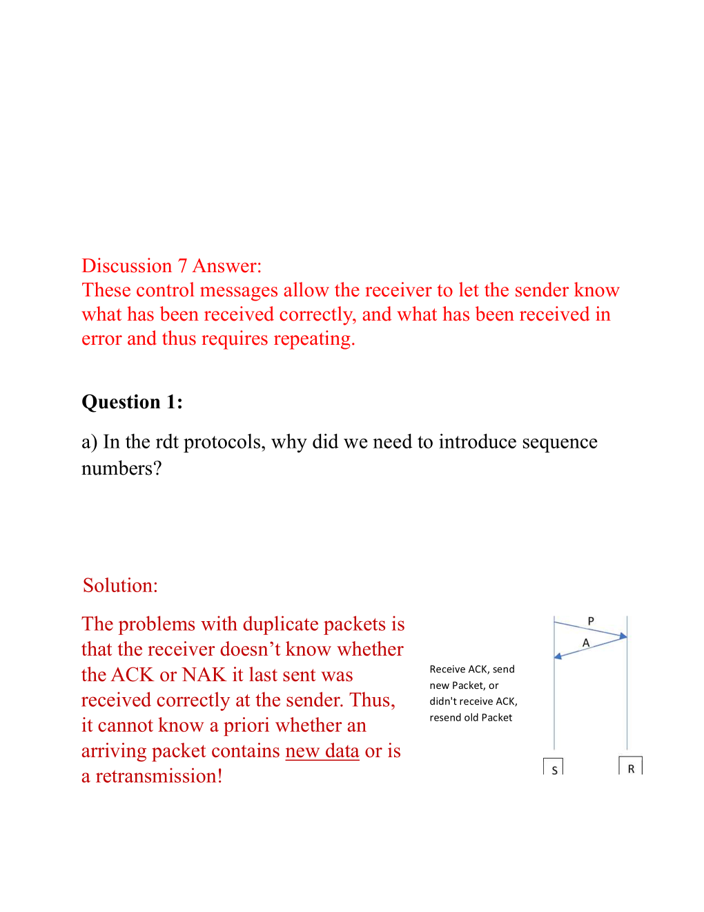
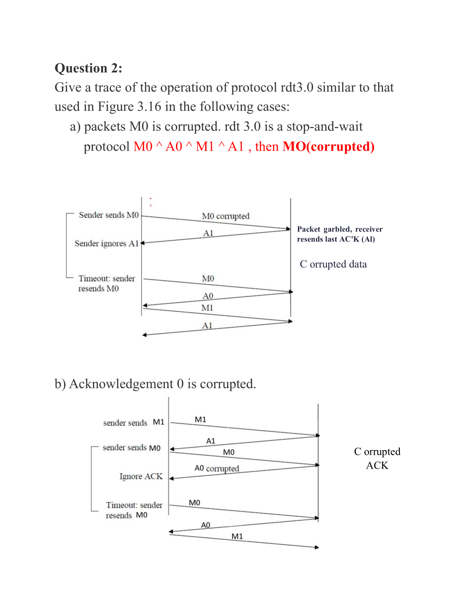

在可靠数据传输协议中，ACK（Acknowledgement，确认）和NAK（Negative Acknowledgement，否定确认）是用来实现数据包确认机制的重要概念。

1. **ACK（确认）**：
   - 当接收方成功接收到一个数据包并且数据包没有错误时，会向发送方发送一个ACK信号。这表示发送方可以继续发送下一个数据包。
   - ACK通常是一个表示成功接收的信号，它告诉发送方数据包已经安全到达。

2. **NAK（否定确认）**：
   - NAK用来表示接收方收到了数据包，但是数据包有错误或者丢失了。发送方在收到NAK后需要重新发送相同的数据包。
   - 尽管NAK可以用来指示错误，但它引入了额外的复杂性和延迟，因为发送方需要在接收到NAK后重发数据包。

为什么我们在设计可靠数据传输协议时通常只使用ACK而不使用NAK呢？

- **简化协议设计**：只使用ACK可以简化协议的设计和实现。发送方只需等待ACK确认，而无需处理NAK带来的复杂性。
  
- **效率考虑**：NAK会增加网络交互的次数，可能会导致网络中的额外负载和延迟。ACK相比之下更高效，因为它仅在成功接收时发送。

如何告诉发送方数据包已经损坏或者丢失了？

- **超时重传**：如果发送方在一定时间内没有收到ACK确认，它会假定数据包已经丢失，并重新发送相同的数据包。
  
- **校验和**：发送方可以在数据包中添加校验和，接收方在接收到数据包后验证校验和。如果校验和不匹配，接收方可以丢弃数据包并通知发送方重新发送。

综上所述，ACK和NAK在可靠数据传输中扮演了重要角色，而在实际设计中，通常选择只使用ACK来简化协议，同时通过超时重传和校验和来处理数据包错误的情况。

