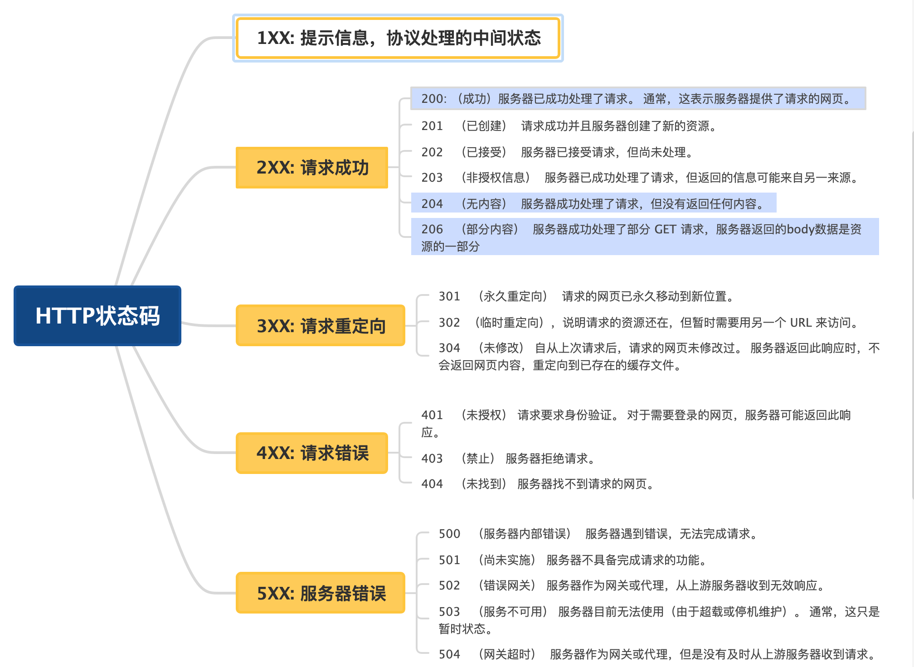
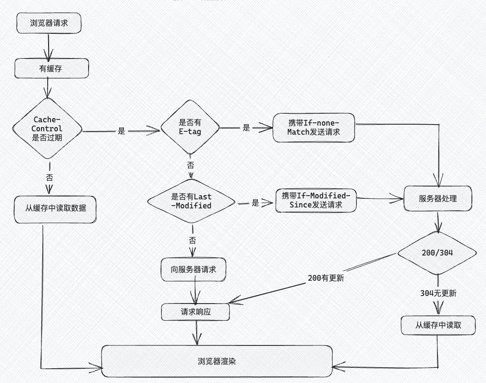

# day1

## osi 模型和 tcp/ip 模型

### osi 模型

掌握程度：
- 理解 osi 模型共有 7 层，能够说明是哪 7 层。

```
OSI模型， 是国际标准化组织（ISO）制定的一个用于计算机或通信系统间互联的标准体系，将计算机网络通信划分为七个不同的层级，每个层级都负责特定的功能。每个层级都构建在其下方的层级之上，并为上方的层级提供服务。七层从下到上分别是```

物理层、数据链路层、网络层、传输层、会话层、表示层和应用层

。虽然OSI模型在理论上更全面，但在实际网络通信中，TCP/IP模型更为实用。 TCP/IP模型分为四个层级，每个层级负责特定的网络功能。
物理层 - Physical Layer
数据链路层 - Data Link Layer
网络层 - Network Layer
传输层 - Transport Layer
会话层 - Session Layer
表示层 - Presentation Layer
应用层 - Application Layer


应用层：该层与OSI模型的应用层和表示层以及会话层类似，提供直接与用户应用程序交互的接口。它为网络上的各种应用程序提供服务，如电子邮件（SMTP）、网页浏览（HTTP）、文件传输（FTP）等。

传输层：该层对应OSI模型的传输层。它负责端到端的数据传输，提供可靠的、无连接的数据传输服务。主要的传输层协议有TCP和UDP。TCP提供可靠的数据传输，确保数据的正确性和完整性；而UDP则是无连接的，适用于不要求可靠性的传输，如实时音频和视频流。

网络层：该层对应OSI模型的网络层。主要协议是IP，它负责数据包的路由和转发，选择最佳路径将数据从源主机传输到目标主机。IP协议使用IP地址来标识主机和网络，并进行逻辑地址寻址。

网络接口层：该层对应OSI模型的数据链路层和物理层。它负责物理传输媒介的传输，例如以太网、Wi-Fi等，并提供错误检测和纠正的功能。此外，网络接口层还包含硬件地址（MAC地址）的管理。
```
- 能够粗浅描述每一层的基本功能和职责
- 对于某些层，熟悉一些常见的协议，比如网络层的 ip，传输层的 tcp 和 udp。

### tcp/ip 模型

掌握程度：
- 理解 tcp/ip 模型通常被描述为 4 层，能够清晰地描述网络模型的层次结构。
- 能够解释每一层的作用，知道 tcp/ip 模型的层次是如何与 osi 模型相对应的。
- 能够举例说明每层使用的协议，对某些层次的深入理解，比如 tcp 的三次握手、四次挥手，ip 数据报的路由选择。
- 理解不同层次间的交互：了解数据是如何在这些层次之间流动的，以及每一层如何为数据的传输添加或移除其所需的头部信息。

参考学习资料：小林coding: tcp/ip 网络模型有哪几层？

### 从输入url到页面展示发生了什么
```
输入网址，解析URL信息，准备发送HTTP请求
检查浏览器缓存里是否有缓存该资源，如果有直接返回；如果没有进入下一步网络请求。
DNS域名解析：网络请求前，进行DNS解析，以获取请求域名的IP地址。如果请求协议是HTTPS，那么还需要建立TLS连接。DNS解析时会按本地浏览器缓存->本地Host文件->路由器缓存->DNS服务器->根DNS服务器的顺序查询域名对应IP，直到找到为止。
TCP三次握手建立连接：浏览器与服务器IP建立TCP连接。
客户端发送HTTP请求：连接建立后，浏览器端会构建请求行、请求头等信息，并把和该域名相关的Cookie等数据附加到请求头中，向服务器构建请求信息。如果是HTTPS的话，还涉及到HTTPS的加解密流程。
服务器处理请求并返回HTTP资源：服务器接收到请求信息，根据请求生成响应数据。
TCP四次挥手断开连接：浏览器与服务器IP断开TCP连接。
浏览器解析响应并渲染页面：
浏览器解析响应头。若响应头状态码为301、302，会重定向到新地址；若响应数据类型是字节流类型，一般会将请求提交给下载管理器；若是HTML类型，会进入下一部渲染流程。
浏览器解析HTML文件，创建DOM树，解析CSS进行样式计算，然后将CSS和DOM合并，构建渲染树；最后布局和绘制渲染树，完成页面展示。
```

掌握程度：
- 基本要求：理解浏览器和服务器之间的交互过程，能够清晰地描述从输入url到页面显示的整个流程。
  - dns解析: 描述如何将域名转换为ip地址。
  - tcp连接建立: 解释tcp三次握手的过程。
  - http请求: 说明浏览器如何构建http请求，并发送到服务器。
  - 服务器处理请求: 描述服务器接收请求、处理请求并生成响应的过程。
  - http响应: 说明服务器如何将响应发送回浏览器。
  - tcp连接关闭: 描述tcp四次挥手的过程。
  - 浏览器渲染页面: 描述浏览器如何解析html、css和javascript，以及构建dom树和渲染树。
  - 页面显示: 解释浏览器如何将渲染树绘制到屏幕上。

- 进阶要求：对每个步骤的关键点有所了解，如dns解析、tcp/ip连接、http请求和响应、浏览器渲染等，引导面试官向具体的问题深入。
- 进阶要求：对页面加载性能优化有所了解，如减少dns查询时间、使用cdn、压缩资源、利用缓存等。

参考学习资料：
- 技术蛋老师：【在浏览器输入url回车之后发生了什么？】
- 小林coding: 从输入url到页面渲染发生了什么
- 面试示范：【面试官：请说一下浏览器从输入url到页面展示这个过程中都经历了什么？你能答出来吗？】
- 视频：【2分钟了解输入url到页面呈现发生了什么？构建前端知识体系】

# day2

## http请求报文和响应报文是怎样的
```
HTTP报文分为请求报文和响应报文。

（1） 请求报文 请求报文主要由请求行、请求头、空行、请求体构成。 请求行包括如下字段：

方法（Method）：指定要执行的操作，如 GET、POST、PUT、DELETE 等。
资源路径（Resource Path）：请求的资源的URI（统一资源标识符）。
HTTP版本（HTTP Version）：使用的HTTP协议版本，如 HTTP/1.1 或 HTTP/2.0。
请求头的字段较多，常使用的包含以下几个：

Host：请求的服务器的域名。

Accept：客户端能够处理的媒体类型。

Accept-Encoding：客户端能够解码的内容编码。

Authorization：用于认证的凭证信息，比如token数据。

Content-Length：请求体的长度。

Content-Type：请求体的媒体类型。

Cookie：存储在客户端的cookie数据。

If-None-Match：资源的ETag值，用于缓存控制。

Connection：管理连接的选项，如 keep-alive。

空行是请求头部和请求主体之间的空行，用于分隔请求头部和请求主体。而请求体通常用于 POST 和 PUT 请求，包含发送给服务器的数据。

（2) 响应报文

HTTP响应报文是服务器向客户端返回的数据格式，用于传达服务器对客户端请求的处理结果以及相关的数据。一个标准的HTTP响应报文通常包含状态行、响应头、空行、响应体。

状态行包含HTTP版本、状态码和状态消息。例如：HTTP/1.1 200 OK

响应头部也是以键值对的形式提供的额外信息，类似于请求头部，用于告知客户端有关响应的详细信息。一些常见的响应头部字段包括：

Content-Type：指定响应主体的媒体类型。

Content-Length：指定响应主体的长度（字节数）。

Server：指定服务器的信息。

Expires: 响应的过期时间，之后内容被认为是过时的。

ETag: 响应体的实体标签，用于缓存和条件请求。

Last-Modified： 资源最后被修改的日期和时间。

Location：在重定向时指定新的资源位置。

Set-Cookie：在响应中设置Cookie。

Access-Control-Allow-Origin: 跨源资源共享（CORS）策略，指示哪些域可以访问资源。

空行（Empty Line）在响应头和响应体之间，表示响应头的结束。而响应体是服务端实际传输的数据，可以是文本、HTML页面、图片、视频等，也可能为空。


```

掌握程度：
- 基本结构: 能够描述http请求报文和响应报文的基本结构和各部分的作用。
- 关键字段: 对请求行、状态行、请求头和响应头中的常见字段有所了解。

### 后续延伸知识点

- http方法: 能够区分并解释不同的http方法及其用途。
- http 版本：熟悉 http 不同版本的特性和之间的区别。
- 状态码: 熟悉常见的http状态码及其含义，特别是2xx、3xx、4xx和5xx系列。
- 安全：了解https、ssl/tls等安全协议及其在http中的应用。
- 优化：知道如何通过请求头和响应头进行性能优化，比如使用etag、last-modified等字段进行 http 缓存控制。

参考学习资料：
- mdn文档：http
- 技术蛋老师：【http是什么？】
- 小林coding: http面试题
- 基本概念不了解的可以看【http_1.1请求报文格式】
- 基本概念不了解的可以看【http_1.1响应报文格式】

## http请求方式有哪些
```
GET：请求指定的资源。
POST：向指定资源提交数据进行处理请求（例如表单提交）。
PUT：更新指定资源。
DELETE：删除指定资源。
HEAD：获取报文首部，不返回报文主体。
OPTIONS：查询服务器支持的请求方法。
PATCH：对资源进行部分更新。
```
掌握程度：
- 方法定义: 能够清晰地定义每个请求方法的基本用途，知道哪些方法可能会改变服务器状态，哪些不会，并能够根据场景选择合适的http方法。
- 安全性: 了解每种方法在安全性方面的考虑，特别是get和post方法的区别。
- 幂等性: 理解幂等性的概念，并能识别哪些http方法是幂等的（如get、put、delete）。

参考资料：
- mdn文档：http请求方法
- 菜鸟教程：http请求方法

## get请求和post请求的区别


```
用途：GET请求通常用于获取数据，POST请求用于提交数据。
数据传输：GET请求将参数附加在URL之后，POST请求将数据放在请求体中。
安全性：GET请求由于参数暴露在URL中，安全性较低；POST请求参数不会暴露在URL中，相对更安全。
数据大小：GET请求受到URL长度限制，数据量有限；POST请求理论上没有大小限制。
幂等性：GET请求是幂等的，即多次执行相同的GET请求，资源的状态不会改变；POST请求不是幂等的，因为每次提交都可能改变资源状态。
缓存：GET请求可以被缓存，POST请求默认不会被缓存。
```

掌握程度：
- 能够清晰地描述get和post请求的基本区别和各自的用途，能够根据场景选择合适的请求方法。
- 知道get请求数据附加在url中，post请求数据在请求体中。
- 理解get和post请求在安全性和幂等性方面的差异。

参考资料：
- 小林coding: get请求和post请求的区别
- mdn文档：post方法
- mdn文档：get方法

# day3

## http请求中常见的状态码

```
200：表示客户端请求成功

201：创建了新资源。

204 ：无内容，服务器成功处理请求，但未返回任何内容。

301：永久重定向

302： 临时重定向

304：请求的内容没有修改过，所以服务器返回此响应时，不会返回网页内容，而是使用缓存

401：请求需要身份验证

403：请求的对应资源禁止被访问

404：服务器无法找到对应资源

500：服务器内部错误

503： 服务不可用

```



掌握程度：
- 状态码：能够根据1xx、2xx、3xx、4xx、5xx分类描述状态码，并对每个类别中的常见状态码能够解释其含义和使用场景。
- 缓存：知道3xx状态码中的重定向是如何工作的。
- 进阶：能够结合实际案例来讨论状态码的使用。

参考资料：
- 【学习新姿势】用说唱rap学会常用http状态码
- mdn: http响应状态码
- 小林coding: http请求中常见的状态码有哪些

## 什么是强缓存和协商缓存
```

强缓存和协商缓存是HTTP缓存机制的两种类型，它们用于减少服务器的负担和提高网页加载速度。

强缓存：客户端在没有向服务器发送请求的情况下，直接从本地缓存中获取资源。
Expires强缓存：设置一个强缓存时间，此时间范围内，从内存中读取缓存并返回。但是因为Expires判断强缓存过期的机制是获取本地时间戳，与之前拿到的资源文件中的Expires字段的时间做比较来判断是否需要对服务器发起请求。这里有一个巨大的漏洞：“如果我本地时间不准咋办？”所以目前已经被废弃了。
Cache-Control强缓存：目前使用的强缓存是通过HTTP响应头中的Cache-Control字段实现，通过max-age来告诉浏览器在指定时间内可以直接使用缓存数据，无需再次请求。
协商缓存：当强缓存失效时，浏览器会发送请求到服务器，通过ETag或Last-Modified等HTTP响应头与服务器进行验证，以确定资源是否被修改。如果资源未修改，服务器返回304 Not Modified状态码，告知浏览器使用本地缓存；如果资源已修改，则返回新的资源，浏览器更新本地缓存。这种方式需要与服务器通信，但可以确保用户总是获取最新的内容。
基于Last-Modified的协商缓存

Last-Modified 是资源的最后修改时间，服务器在响应头部中返回。
当客户端读取到Last-modified的时候，会在下次的请求标头中携带一个字段:If-Modified-Since，而这个请求头中的If-Modified-Since就是服务器第一次修改时候给他的时间
服务器比较请求中的 If-Modified-Since 值与当前资源的 Last-Modified 值，如果比对的结果是没有变化，表示资源未发生变化，返回状态码 304 Not Modified。如果比对的结果说资源已经更新了，就会给浏览器正常返回资源，返回200状态。
但是这样的协商缓存有两个缺点：

因为是更改文件修改时间来判断的，所以在文件内容本身不修改的情况下，依然有可能更新文件修改时间（比如修改文件名再改回来），这样，就有可能文件内容明明没有修改，但是缓存依然失效了。
当文件在极短时间内完成修改的时候（比如几百毫秒）。因为文件修改时间记录的最小单位是秒，所以，如果文件在几百毫秒内完成修改的话，文件修改时间不会改变，这样，即使文件内容修改了，依然不会返回新的文件。
基于ETag的协商缓存：将原先协商缓存的比较时间戳的形式修改成了比较文件指纹（根据文件内容计算出的唯一哈希值）。

ETag 是服务器为资源生成的唯一标识符（文件指纹），可以是根据文件内容计算出的哈希值，服务端将其和资源一起放回给客户端。
客户端在请求头部的 If-None-Match 字段中携带上次响应的 ETag 值。
服务器比较请求中的 If-None-Match 值与当前资源的 ETag 值，如果匹配，表示资源未发生变化，返回状态码 304 Not Modified。如果两个文件指纹不吻合，则说明文件被更改，那么将新的文件指纹重新存储到响应头的ETag中并返回给客户端 
```



掌握程度：
- 基本概念：区分强缓存和协商缓存的概念，并解释它们的不同用途。
- 工作流程: 能够描述浏览器和服务器在强缓存和协商缓存中如何交互。
- http头部字段: 知道实现强缓存和协商缓存的http头部字段，如 cache-control, last-modified, etag, if-modified-since, if-none-match。
- 性能优化: 理解缓存机制如何提高web应用的性能和用户体验。

参考资料：
- 小林coding: http缓存
- 视频解析：【http缓存过程】
- mdn文档

# day4

## http1.0和http1.1的区别

掌握程度：
- 特性：掌握 http1.1 的特性，能够描述其优缺点。
- 主要区别: 能够清晰地描述http/1.0和http/1.1的主要区别（持久连接和管道）
- 持久连接: 知道http/1.1支持持久连接。
- 管道化: 理解http/1.1的管道化技术。

参考资料：
- 技术蛋老师：【http/1.1，http/2和http/3的区别】
- 小林coding: http1.1特性

```
持久连接：HTTP/1.1 默认支持持久连接，允许在一个TCP连接上发送多个HTTP请求和响应，减少了连接建立和关闭的开销。而HTTP/1.0 默认为短连接，每次请求都需要建立一个TCP连接，并通过Connection: keep-alive头来实现持久连接。

管道化：HTTP/1.1 支持管道化(不是默认开启)，允许客户端在第一个请求的响应到达之前发送多个请求，这可以减少等待时间，提高效率。HTTP/1.0不支持管道化。

缓存控制：HTTP1.0主要使用If-Modified-Since/Expires来做为缓存判断的标准，而HTTP1.1则引入了更多的缓存控制策略例如Etag / If-None-Match等更多可供选择的缓存头来控制缓存策略。

错误处理：HTTP/1.1 增加了一些新的HTTP状态码，如100 Continue，用于增强错误处理和请求的中间响应。

Host 头：HTTP/1.1 引入了Host头，允许客户端指定请求的主机名，这使得在同一台服务器上托管多个域名成为可能。HTTP/1.0没有这个头字段。

带宽优化 ：HTTP1.0中，存在一些浪费带宽的现象，例如客户端只是需要某个对象的一部分，而服务器却将整个对象送过来了，并且不支持断点续传功能， 而HTTP1.1则在请求头引入了range头域，它允许只请求资源的某个部分，即返回码是206（Partial Content）
```


## http2.0与http1.1的区别

掌握程度：
- 改进之处：了解 http/1.1 协议存在的性能问题
- 头部压缩: 了解 http/2 的头部压缩机制，以及它如何减少数据传输量。
- 二进制协议: 理解 http/2 使用二进制协议对性能的改进。
- 多路复用: 知道 http/2 支持在单个连接上并行发送多个请求和响应，以及它如何减少连接开销。
- 服务器推送: 知道服务器推送的概念，以及它如何帮助优化页面加载时间。
- 协议细节: 对 http/2 的协议细节有深入了解，如帧的类型和用途、流的状态管理等。
- 理解 http/2 队头阻塞问题的原因。

```
二进制协议：HTTP/2.0 采用二进制格式传输数据，而非HTTP/1.1 的文本格式，使得解析更高效，减少了解析时间。
多路复用：HTTP/2.0 支持多路复用，允许在单个TCP连接上并行交错发送多个请求和响应，解决了HTTP/1.1 中的队头阻塞问题。
头部压缩：HTTP/2.0 引入了HPACK 压缩算法，对请求和响应的头部信息进行压缩，减少了冗余头部信息的传输，提高了传输效率。
服务器推送：HTTP/2.0 允许服务器主动推送资源给客户端，而不需要客户端明确请求，这可以减少页面加载时间。
优先级和依赖：HTTP/2.0 允许客户端为请求设置优先级，并表达请求之间的依赖关系，资源加载更加有序。
```


参考资料：
- 小林coding: http/2做了什么优化
- 小林coding: http/2 牛逼在哪？

## http3.0有了解过吗？

掌握程度：
- quic 协议: 理解 http/3 是基于 udp 的 quic 协议 而不是 tcp。
- 性能提升: 知道 http/3 相对于 http/2 在性能上的提升，特别是在连接建立和 队头阻塞 方面。

加分项：
- 技术细节: 对 quic 协议的技术细节有深入了解，如它的数据包结构、传输机制等。
- 性能对比: 能够对比 http/2 和 http/3 在性能和使用场景上的差异。

参考资料：
- 小林coding: http/3 做了哪些优化？
- 小林coding: http/3 强势来袭
- 极客时间：http专栏

# day5

## https和http有哪些区别

掌握程度：
- 基本概念：理解 http 和 https 的基本概念
- 主要区别：能够清晰地区分 http 和 https 的主要特点和用途，以及在安全性、加密、端口号、证书等方面的区别。
- 安全性：理解 https 如何通过加密技术提高数据传输的安全性。

参考资料：
- 小林coding: https和http有哪些区别
- 【https是什么？加密原理和证书。ssl/tls握手过程】

```
两者的主要区别在于安全性和数据加密：

加密层：HTTPS 在HTTP 的基础上增加了SSL/TLS 协议作为加密层，确保数据传输的安全性。而HTTP 数据传输是明文的，容易受到攻击。
HTTP 连接建立相对简单， TCP 三次握手之后便可进行 HTTP 的报文传输。而 HTTPS 在 TCP 三次握手之后，还需进行 SSL/TLS 的握手过程，才可进入加密报文传输。
端口：HTTPS 通常使用端口443 ，而HTTP 使用端口80。
HTTPS 协议需要向 CA 申请数字证书，来保证服务器的身份是可信的。

```


## https工作原理

```
HTTPS 主要基于SSL/TLS 协议，确保了数据传输的安全性和完整性, 其建立连接并传输数据的过程如下：

密钥交换：客户端发起HTTPS请求后，服务器会发送其公钥证书给客户端。

证书验证：客户端会验证服务器的证书是否由受信任的证书颁发机构（CA ）签发，并检查证书的有效性。

加密通信：一旦证书验证通过，客户端会生成一个随机的对称加密密钥，并使用服务器的公钥加密这个密钥，然后发送给服务器。

建立安全连接：服务器使用自己的私钥解密得到对称加密密钥，此时客户端和服务器都有了相同的密钥，可以进行加密和解密操作。

数据传输：使用对称加密密钥对所有传输的数据进行加密，确保数据在传输过程中的安全性。

完整性校验：SSL/TLS协议还包括消息完整性校验机制，如消息认证码，确保数据在传输过程中未被篡改。

结束连接：数据传输完成后，通信双方会进行会话密钥的销毁，以确保不会留下安全隐患。
```


掌握程度：
- 理解https通过ssl/tls 协议来提供安全性。
- 理解ssl/tls握手过程的各个步骤，包括证书的验证和密钥交换。
- 知道非对称加密和对称加密在https中的作用和区别。
- 了解数据完整性和身份验证的重要性。知道https使用数字证书来验证服务器的身份，这些证书通常由受信任的证书颁发机构(ca)签发。理解如何使用消息认证码(mac)或数字签名来确保数据在传输过程中的完整性。

加分项：
- 能够讨论https对性能的影响以及如何优化。

参考资料：
- 【https是什么？加密原理和证书。ssl/tls握手过程】
- 小林coding: https连接过程
- 小林coding: https如何优化

## tcp和udp的区别

掌握程度：
- 可以仅做了解：了解tcp和udp的报文结构和传输方式。
- 能够清晰地描述tcp和udp的基本特性和区别，理解tcp的可靠性和udp的效率。
- 知道tcp和udp在不同应用场景下的适用性。
- 协议细节：对tcp和udp的协议细节有深入了解，如tcp的三次握手、udp的校验和计算等。
- 延伸项（需要掌握）：能够讨论tcp的流量控制和拥塞控制机制。
- 加分项：了解如何在实际应用中根据需求选择和优化tcp或udp的使用。

参考资料：
- 【计算机网络微课堂第067讲 udp和tcp的对比】

# day6

## tcp连接如何确保可靠性
```
TCP通过差错控制（序列号、确认应答、数据校验）、超时重传、流量控制、拥塞控制等机制，确保了数据传输的可靠性和效率。

序列号：每个TCP段都有一个序列号，确保数据包的顺序正确。
数据校验：TCP使用校验和来检测数据在传输过程中是否出现错误，如果检测到错误，接收方会丢弃该数据包，并等待重传。
确认应答：接收方发送ACK确认收到的数据，如果发送方在一定时间内没有收到确认，会重新发送数据。
超时重传：发送方设置一个定时器，如果在定时器超时之前没有收到确认，发送方会重传数据。
流量控制：TCP通过滑动窗口机制进行流量控制，确保接收方能够处理发送方的数据量。
拥塞控制：TCP通过算法如慢启动、拥塞避免、快重传和快恢复等，来控制数据的发送速率，防止网络拥塞。
```
掌握程度：
- 能够清晰地描述tcp协议的工作原理和关键特性。
- 理解tcp如何通过各种机制确保数据传输的可靠性。
  - 连接管理：三次握手，四次挥手
  - 差错控制：序列号和确认应答机制
  - 超时重传机制
  - 流量控制
  - 拥塞控制
- 知道tcp的流量控制和拥塞控制对于网络性能的影响。

参考资料：
- 小林coding: tcp如何确保可靠性
- 『深入 tcp/ip 系列』一文搞懂 tcp 的可靠性

## tcp 拥塞控制机制

```
TCP拥塞控制可以在网络出现拥塞时动态地调整数据传输的速率，以防止网络过载。TCP拥塞控制的主要机制包括以下几个方面：

慢启动（Slow Start）： 初始阶段，TCP发送方会以较小的发送窗口开始传输数据。随着每次成功收到确认的数据，发送方逐渐增加发送窗口的大小，实现指数级的增长，这称为慢启动。这有助于在网络刚开始传输时谨慎地逐步增加速率，以避免引发拥塞。
拥塞避免（Congestion Avoidance）： 一旦达到一定的阈值（通常是慢启动阈值），TCP发送方就会进入拥塞避免阶段。在拥塞避免阶段，发送方以线性增加的方式增加发送窗口的大小，而不再是指数级的增长。这有助于控制发送速率，以避免引起网络拥塞。
快速重传（Fast Retransmit）： 如果发送方连续收到相同的确认，它会认为发生了数据包的丢失，并会快速重传未确认的数据包，而不必等待超时。这有助于更快地恢复由于拥塞引起的数据包丢失。
快速恢复（Fast Recovery）： 在发生快速重传后，TCP进入快速恢复阶段。在这个阶段，发送方不会回到慢启动阶段，而是将慢启动阈值设置为当前窗口的一半，并将拥塞窗口大小设置为慢启动阈值加上已确认但未被快速重传的数据块的数量。这有助于更快地从拥塞中恢复。

```


掌握程度：
- 能够解释为什么需要拥塞控制，即动态调整数据的发送速率，防止网络过载，保证网络的稳定和高效。
- 掌握拥塞控制的主要算法
  - 慢启动：开始时，发送窗口大小逐渐增加，直到达到一个阈值。
  - 拥塞避免：超过阈值后，窗口大小增长速度减慢，采用线性增长。
  - 快重传：当接收方检测到失序的包时，立即发送重复确认，触发发送方进行重传。
  - 快恢复：在快重传后，不立即回到慢启动状态，而是尝试继续以当前窗口大小发送。

参考资料：
- 【计算机网络微课堂第069讲 tcp的拥塞控制】

## tcp 流量控制机制

掌握程度：
- 能够解释流量控制的目的。能够清晰地描述tcp流量控制的基本工作原理和关键组件。
- 知道 tcp 是使用滑动窗口机制来实现流量控制，理解tcp滑动窗口协议的工作原理，包括窗口大小的通告和更新
- 知道流量控制与拥塞控制的区别和它们在tcp中的作用。
- 了解tcp报文结构，特别是与流量控制相关的字段。

参考资料：
- 【计算机网络微课堂第068讲 tcp的流量控制】

# day7

## udp怎么实现可靠传输

掌握程度：
- 掌握基于 udp 协议实现可靠传输的方式。

参考资料：
- 小林coding: 如何基于 udp 协议实现可靠传输？

# day8

## 三次握手


```

(1) 三次握手的过程

第一次握手：客户端向服务器发送一个SYN （同步序列编号）报文，请求建立连接，客户端进入SYN_SENT 状态。
第二次握手：服务器收到SYN 报文后，如果同意建立连接，则会发送一个SYN-ACK （同步确认）报文作为响应，同时进入SYN_RCVD 状态。
第三次握手：客户端收到服务器的SYN-ACK 报文后，会发送一个ACK （确认）报文作为最终响应，之后客户端和服务器都进入ESTABLISHED 状态，连接建立成功。
(2)为什么需要三次握手

通过三次握手，客户端和服务器都能够确认对方的接收和发送能力。第一次握手确认了客户端到服务器的通道是开放的；第二次握手确认了服务器到客户端的通道是开放的；第三次握手则确认了客户端接收到服务器的确认，从而确保了双方的通道都是可用的。

而如果仅使用两次握手，服务器可能无法确定客户端的接收能力是否正常，比如客户端可能已经关闭了连接，但之前发送的连接请求报文在网络上延迟到达了服务器，服务器就会主动去建立一个连接，但是客户端接收不到，导致资源的浪费。而四次握手可以优化为三次。
```


掌握程度：
- 能够清晰地描述tcp三次握手的每个步骤和目的。
- 理解序列号和确认号的重要性，以及它们在建立连接中的作用。
- 扩展：知道三次握手过程中可能存在的安全问题，如syn洪泛攻击，以及如何防范。

参考资料：
- 动画解析：【一条视频讲清楚tcp协议与udp协议-什么是三次握手与四次挥手】
- 模拟回答：【面试官居然把tcp三次握手问得这么详细】

## 四次挥手的过程


```
（1）四次挥手的过程

第一次挥手：客户端发送一个FIN报文给服务端，表示自己要断开数据传送，报文中会指定一个序列号 (seq=x)。然后,客户端进入FIN-WAIT-1 状态。
第二次挥手：服务端收到FIN报文后，回复ACK报文给客户端，且把客户端的序列号值+1，作为ACK报文的序列号(seq=x+1)。然后，服务端进入CLOSE-WAIT(seq=x+1)状态，客户端进入FIN-WAIT-2状态。
第三次挥手：服务端也要断开连接时，发送FIN报文给客户端，且指定一个序列号(seq=y+1)，随后服务端进入LAST-ACK状态。
第四次挥手：客户端收到FIN报文后，发出ACK报文进行应答，并把服务端的序列号值+1作为ACK报文序列号(seq=y+2)。此时客户端进入TIME-WAIT状态。服务端在收到客户端的ACK 报文后进入CLOSE 状态。如果客户端等待2MSL没有收到回复，才关闭连接。
（2）为什么需要四次挥手

TCP是全双工通信，可以双向传输数据。任何一方都可以在数据传送结束后发出连接释放的通知，待对方确认后进入半关闭状态。 当另一方也没有数据再发送的时候，则发出连接释放通知，对方确认后才会完全关闭 TCP 连接。因此两次挥手可以释放一端到另一端的TCP连接，完全释放连接一共需要四次挥手。

只有通过四次挥手，才可以确保双方都能接收到对方的最后一个数据段的确认，主动关闭方在发送完最后一个ACK后进入TIME-WAIT 状态，这是为了确保被动关闭方接收到最终的ACK ，如果被动关闭方没有接收到，它可以重发FIN 报文，主动关闭方可以再次发送ACK 。

而如果使用三次挥手，被动关闭方可能在发送最后一个数据段后立即关闭连接，而主动关闭方可能还没有接收到这个数据段的确认。

```

掌握程度：
- 能够清晰地描述tcp四次挥手的每个步骤和原因。
- 知道time-wait状态的重要性和2msl等待期的作用。

参考资料：
- 动画解析：【一条视频讲清楚tcp协议与udp协议-什么是三次握手与四次挥手】

## http的keep-alive是什么？tcp 的 keepalive 和 http 的 keep-alive 是一个东西吗？

掌握程度：
- 能够清晰地解释http的keep-alive和tcp的keepalive的概念及其目的。知道http的keep-alive如何通过http头启用，以及tcp的keepalive如何通过系统设置或编程接口配置。
- 理解两者在网络通信中的作用和区别。
  - http的keep-alive是一种机制，允许客户端和服务器在单个tcp连接上发送多个http请求和响应，而不是每个请求/响应后都关闭连接。
  - tcp的keepalive用于检测和清除死tcp连接。

参考资料：
- 小林coding: tcp keepalive 和 http keep-alive 是一个东西吗？
- 视频解析（过长）：http长连接和短连接？(http keep_alive tcp keep_alive  心跳检测机制】

# day9

## dns 查询过程

```
DNS 用来将主机名和域名转换为IP地址, 其查询过程一般通过以下步骤：

本地DNS缓存检查：首先查询本地DNS缓存，如果缓存中有对应的IP地址，则直接返回结果。
如果本地缓存中没有，则会向本地的DNS服务器（通常由你的互联网服务提供商（ISP）提供， 比如中国移动）发送一个DNS查询请求。
如果本地DNS解析器有该域名的ip地址，就会直接返回，如果没有缓存该域名的解析记录，它会向根DNS服务器发出查询请求。根DNS服务器并不负责解析域名，但它能告诉本地DNS解析器应该向哪个顶级域（.com/.net/.org）的DNS服务器继续查询。
本地DNS解析器接着向指定的顶级域名DNS服务器发出查询请求。顶级域DNS服务器也不负责具体的域名解析，但它能告诉本地DNS解析器应该前往哪个权威DNS服务器查询下一步的信息。
本地DNS解析器最后向权威DNS服务器发送查询请求。 权威DNS服务器是负责存储特定域名和IP地址映射的服务器。当权威DNS服务器收到查询请求时，它会查找"example.com"域名对应的IP地址，并将结果返回给本地DNS解析器。
本地DNS解析器将收到的IP地址返回给浏览器，并且还会将域名解析结果缓存在本地，以便下次访问时更快地响应。
浏览器发起连接： 本地DNS解析器已经将IP地址返回给您的计算机，您的浏览器可以使用该IP地址与目标服务器建立连接，开始获取网页内容。

```

掌握程度：
- 了解 dns 概念及其作用
- 能够清晰地描述dns查询的基本过程，包括递归查询和迭代查询。
- 知道dns查询可能涉及的不同层级的dns服务器。

参考资料：
- 技术蛋老师：【dns域名解析过程】
- 小林coding: dns域名解析过程

## cdn 是什么


```
CDN是一种分布式网络服务，通过将内容存储在分布式的服务器上，使用户可以从距离较近的服务器获取所需的内容，从而加速互联网上的内容传输。

就近访问：CDN 在全球范围内部署了多个服务器节点，用户的请求会被路由到距离最近的 CDN 节点，提供快速的内容访问。
内容缓存：CDN 节点会缓存静态资源，如图片、样式表、脚本等。当用户请求访问这些资源时，CDN 会首先检查是否已经缓存了该资源。如果有缓存，CDN 节点会直接返回缓存的资源，如果没有缓存所需资源，它会从源服务器（原始服务器）回源获取资源，并将资源缓存到节点中，以便以后的请求。通过缓存内容，减少了对原始服务器的请求，减轻了源站的负载。
可用性：即使某些节点出现问题，用户请求可以被重定向到其他健康的节点。

```

掌握程度：
- 能够清晰地描述cdn的概念、工作原理和主要优势。
- 理解cdn的关键组件和缓存策略。
- 知道cdn在提高网站性能和用户体验方面的作用。

参考资料：
- 【什么是cdn？cdn能为我们做什么？我们为什么要了解他？】

## cookie和session是什么？有什么区别？

掌握程度：
- 能够清晰地描述cookie和session的定义、存储位置、生命周期、大小限制和安全性。
- 理解cookie和session的使用场景和它们在web应用中的不同作用。
- 能够讨论cookie和session的安全性问题以及如何提高它们的安全性。

扩展：
- 结合案例讨论cookie和session的使用
- 了解如何通过设置httponly、secure标志，以及使用samesite属性来提高cookie的安全性。

参考资料：
- 【cookie、session、token究竟区别在哪？如何进行身份认证，保持用户登录状态？】

